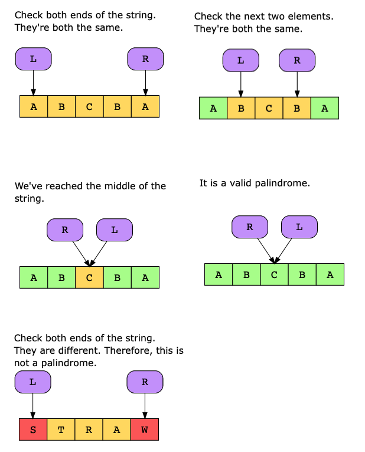

# Valid Palindrome

Write a function that takes a string, s, as an input and determines whether or not it is a palindrome.

Constraints:

- 1≤ s.length ≤2×10^5
- The string s will contain English uppercase and lowercase letters, digits, and spaces.

## Solution

The naive approach to solve this problem is to reverse the string and then compare the reversed string with the original string. If they match, the original string is a valid palindrome. Although this solution has a linear time complexity, it requires extra space to store the reversed string, making it less efficient in terms of space complexity. Therefore, we can use an optimized approach to save extra space.

The two-pointers approach would allow us to solve this problem in linear time, without any additional space complexity or the use of built-in functions. This is because we’ll traverse the array from the start and the end simultaneously to reach the middle of the string.

### Step-by-step solution construction

We’ll have two pointers, where the first pointer is at the starting element of our string, while the second pointer is at the end of the string. We move the two pointers towards the middle of the string and, at each iteration, we compare each element. The moment we encounter a nonidentical pair, we can return FALSE because our string can’t be a palindrome.

### Time complexity

The time complexity is O(n), where nn is the number of characters in the string. However, our algorithm will only run (n/2) times, since two pointers are traversing toward each other.

### Space complexity

The space complexity is O(1), since we use constant space to store two indexes.