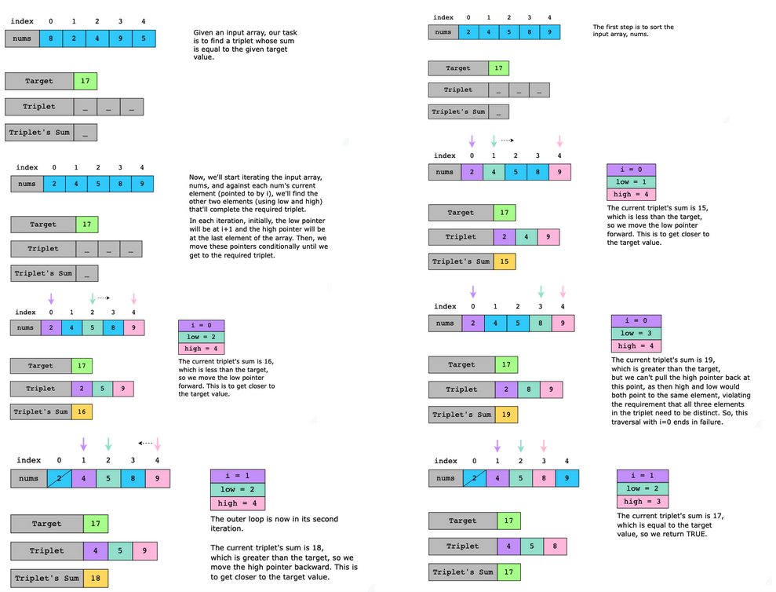

# Sum of Three Values

Given an array of integers, nums, and an integer value, target, determine if there are any three integers in nums whose sum is equal to the target, that is, nums[i] + nums[j] + nums[k] == target. Return TRUE if three such integers exist in the array. Otherwise, return FALSE.

Constraints:

- 3 ≤ nums.length ≤ 500
- −103 ≤ nums[i] ≤ 103
- −103 ≤ target ≤ 10310

## Solution

The naive approach to solving this problem is to use three nested loops. Each nested loop starts at the index greater than its parent loop. For example, if we use the iterators i, j, and k in the loops, j will start from i + 1, and k will start from j + 1. This approach will check all the possible triplets to see if they sum up to the required target value.

Since we’re using three nested loops, the overall time complexity for this solution is O(n^3). However, we aren’t using any extra space to get to the final output, so the space complexity is O(1).

We need to find three integers that sum up to the target value. We use this pattern inside an additional loop. In the loop, we keep one value of the array with us and then look for the other two integers against this selected value that complete the triplet whose sum equals the target value.

First, we sort the input array, nums, in ascending order. This is because traversing an unsorted array would lead to a bad time complexity. If the input array is sorted, we can easily decide, depending on the sum of the current triplet, whether to move the low pointer toward the end, or, the high pointer toward the start. Next, we iterate over the elements in nums using the index i, where i << length.nums - 2. Against each nums[i], we find the other two integers that complete the triplet whose sum equals the target value, that is, nums[i] + nums[low] + nums[high] == target. We do this by traversing nums with the low and high pointers. In each iteration, the traversal starts with the low pointer being at nums[i+1] and the high pointer at the last element of nums. Then, depending on the current sum value, we move these pointers as follows:

- If the sum of the triplet is equal to the target, we return TRUE. Otherwise, we continue.
- If the sum of the triplet is less than the target, we move the low pointer forward, that is, toward the end. The aim is to increase the value of the sum so that it gets closer or equal to the target value.
- If the sum of the triplet is greater than the target, we move the high pointer toward the start. The aim is to reduce the value of the sum so that it gets closer or equal to the target value.

We repeat this for each iteration until we get the required triplet.

### Time complexity

The sorting the array takes O(nlog(n)) and the nested loop takes O(n^2) to find the triplet. Here, n is the number of elements in the input array. Therefore, the total time complexity of this solution is O(nlog(n)+n2), which simplifies to O(n^2).

### Space complexity

The space complexity of this solution, primarily, depends on the sorting algorithm we use. We use the built-in Java function, Arrays.sort(), so the space complexity of the provided solution is O(1).