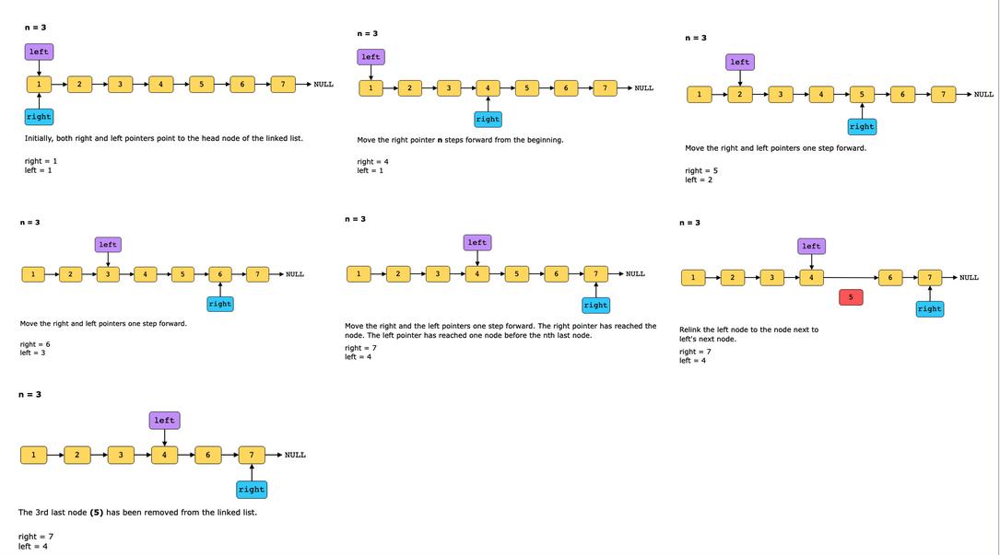

# Remove nth Node from End of List

Given a singly linked list, remove the nth node from the end of the list and return its head.

Constraints:

- The number of nodes in the list is k.
- 1 ≤ k ≤ 103
- −103 ≤ Node.value ≤ 103
- 1 ≤ n ≤ k

## Solution

The naive approach calculates the length of the linked list by traversing the complete list. Then, we set a pointer, say ptr, at the start of the list and move it through the list till it reaches the (k−n−1)^th node. The ptr pointer now points to the node before the target node, i.e., the nthnth last node. Save the next node of the ptr in a temporary pointer. Relink the ptr node to the node next to ptr ’s next node. Delete the node pointed by the temporary pointer. By doing so, the nthnth last node will be removed. However, this approach traverses the linked list twice.

To implement two pointers pattern in this problem, the following steps are necessary:

1. Two pointers, right and left, are set at the head node.
2. Move the right pointer n steps forward.
3. If right reaches NULL, return head's next node.
4. Move both right and left pointers forward till right reaches the last node.
5. Relink the left node to the node at left's next to the next node.
6. Return head.

### Time complexity

The time complexity is O(n), where nn is the number of nodes in the linked list.

### Space complexity

The space complexity is O(1) because we use constant space to store two pointers.