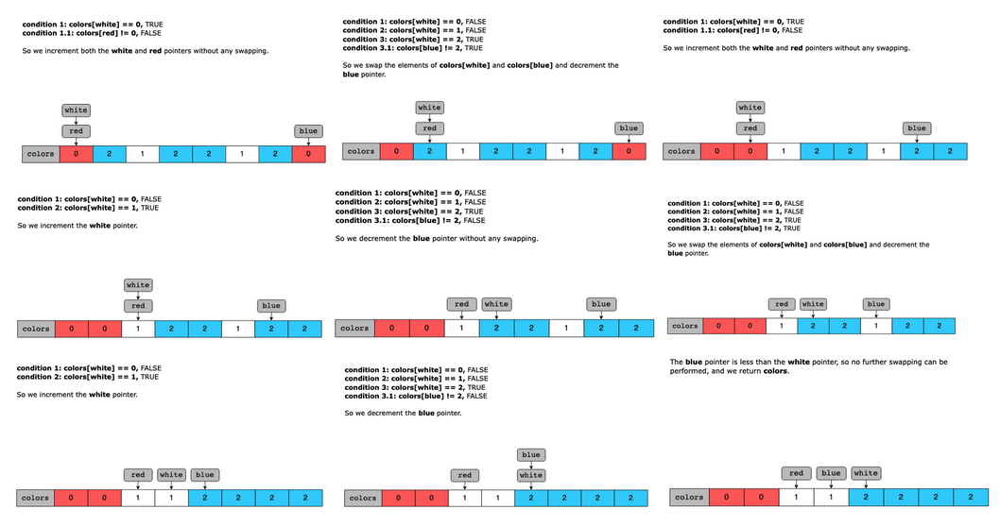

# Sort Colors

Given an array, colors, which contains a combination of the following three elements:

- 0 (representing red)
- 1 (representing white)
- 2 (representing blue)

Sort the array in place so that the elements of the same color are adjacent, with the colors in the order of red, white, and blue. The function should return the same array.

Constraints:

- 1 ≤ colors.length ≤ 300  
- colors[i] can only contain 0s, 1s, or 2s.

## Solution

The naive approach would be to sort the array. This would arrange the elements in the desired positions, i.e., 0s, then 1s, and last, 2s. The time complexity of this approach would be O(nlog(n)), which is the time required to sort the array. The space complexity of this approach would be O(1) since no extra space is being used.

The solution to this problem with two pointers can be divided into five main parts:

1. We traverse the array using three pointers, red, white, and blue.
2. If the element pointed to by the white pointer is 00, we swap it with the element pointed to by the red pointer if it’s not pointing to 00, and increment both the red and white pointers.
3. If the element pointed to by the white pointer is 11, we increment the white pointer.
4. If the element pointed to by the white pointer is 22, we swap it with the element pointed to by the blue pointer if it’s not pointing to 22 and decrement the blue pointer.
5. The array is sorted when the blue pointer becomes less than the white pointer.

### Time complexity

The time complexity of this solution is O(n) since we’re only traversing the array once.

### Space complexity

The space complexity of this solution is O(1) since no extra space is used.