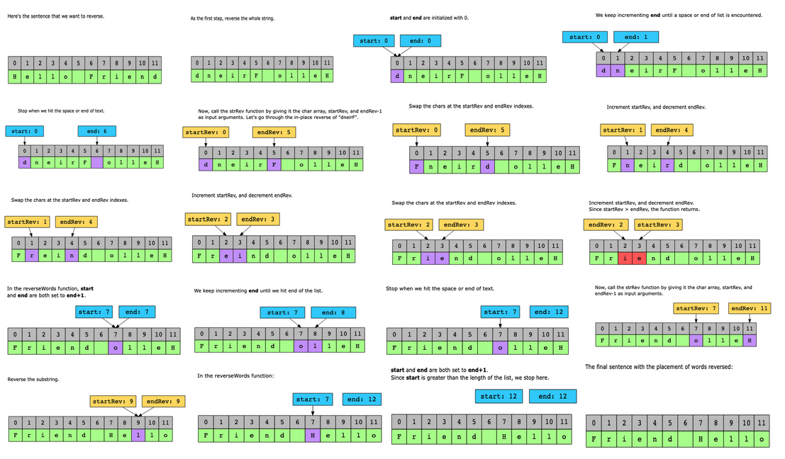

# Reverse Words in a String

Given a sentence, reverse the order of its words without affecting the order of letters within a given word.

Constraints:

- Sentence contains English uppercase and lowercase letters, digits, and spaces.
- 1 ≤ sentence.length ≤ 104
- The order of the letters within a word is not to be reversed.

## Solution

In this problem, we first reverse the complete string. Now take two pointers, start and end, initialized with the start of the list, which is index 0.

Now, iterate a loop until start is less than the length of the list, and in each iteration, move the end pointer forward until it hits a space. At this point, we have a complete word starting from the start index to the end-1 index, but with the characters in reverse order.

To change the order of characters, we call the strRev function with the starting and ending positions of the word. This will reverse the characters in the word.

Now, we update the start and end pointers to the next of end pointer, which is basically the first character of the next word. Now, repeat this process for the next word. At the end of all iterations, we get the reversed words in the string.

### Time complexity

Because the array is traversed twice, the time complexity of this solution is O(n+n)=O(n), where nn is the length of the string.

### Space complexity

The space complexity of this solution is O(n) as, at the start of the algorithm, to overcome the issue of strings being immutable in Java, we copy it into a list of characters.