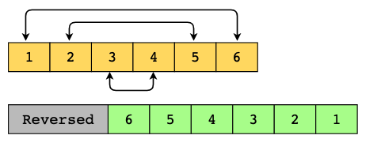
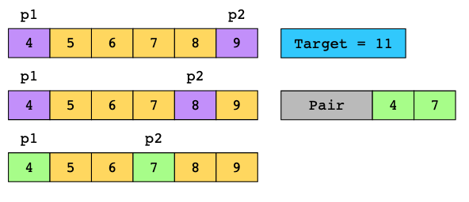

# Two Pointers

The two pointers pattern uses two pointers to iterate over an array or list until the conditions of the problem are satisfied. This is useful because it allows us to keep track of the values of two different indexes in a single iteration. 

The pointers can be used to iterate the data structure in one or both directions, depending on the problem statement. For example, to identify whether a string is a palindrome, we can use one pointer to iterate the string from the beginning and the other to iterate it from the end. At each step, we can compare the values of the two pointers and see if they meet the palindrome properties.

The naive approach to solving this problem would be using nested loops, with a time complexity of O(n^2). However, by using two pointers moving towards the middle from either end, we exploit the symmetry property of palindromic strings. This allows us to compare the elements in a single loop, making the algorithm more efficient with a time complexity of O(n).

## Conditions

- The input data can be traversed in a linear fashion, that is, it’s in an array, in a linked list, or in a string of characters.
- We limit our focus to a specific range of elements within the input data, as dictated by the positions of the two pointers, allowing us to consider a small subset of elements rather than the entire set.

## Examples

- Reversing an Array: Traverse the array from the beginning and the end, and swap the values until we reach the middle.

- Pair with Given Sum in a Sorted Array

### Real-world problems

Many problems in the real world use the two pointers pattern. Let’s look at some examples.

- Memory management: Two pointers are vital in memory allocation and deallocation. The memory pool is initialized with two pointers: the start pointer, pointing to the beginning of the available memory block, and the end pointer, indicating the end of the block. When a process or data structure requests memory allocation, the start pointer is moved forward, designating a new memory block for allocation. Conversely, when memory is released (deallocated), the start pointer is shifted backward, marking the deallocated memory as available for future allocations.
- Product suggestions: While shopping online, when customers view their cart and the current total doesn’t qualify for free shipping, we want to show them pairs of products that can be bought together to make the total amount equal to the amount required to be eligible for free delivery. Two pointers can be used to suggest the pairs that add up to the required cost for free shipping.
