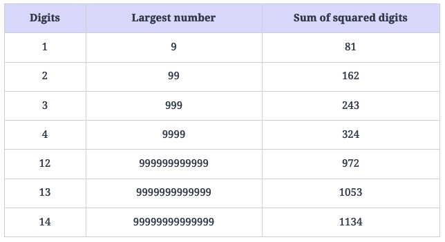

# Happy Number

Write an algorithm to determine if a number nn is a happy number.

We use the following process to check if a given number is a happy number:

- Starting with the given number nn, replace the number with the sum of the squares of its digits.
- Repeat the process until:
  - The number equals 11, which will depict that the given number nn is a happy number.
  - It enters a cycle, which will depict that the given number nn is not a happy number.

Return TRUE if nn is a happy number, and FALSE if not.

Constraints

- 1 ≤ n ≤ 231−1

## Solution

The brute force approach is to repeatedly calculate the squared sum of digits of the input number and store the computed sum in a hash set. For every calculation, we check if the sum is already present in the set. If yes, we've detected a cycle and should return FALSE. Otherwise, we add it to our hash set and continue further. If our sum converges to 11, we've found a happy number.

While this approach works well for small numbers, we might have to perform several computations for larger numbers to get the required result. So, it might get infeasible for such cases. The time complexity of this approach is O(log n). The space complexity is O(log n) since we're using additional space to store our calculated sums.

n efficient approach to solve this problem is to use fast and slow pointers. We know that a unhappy number eventually gets stuck in an infinite loop. However, there is no way for our program to detect this loop and terminate, unless we keep track of the calculated sums, which requires additional space.

If we use the fast and slow pointers approach here, the fast pointer would eventually reach 1, in which case we will return TRUE. Otherwise, it would meet the slow pointer, which would mean that the two pointers are in an endless loop, and we can return FALSE.

As an example, suppose we have the number 2 as our n. This is what the infinite loop would look like:

### Step-by-step solution construction

We will start off our solution by constructing a helper function to calculate the squared sum of digits of the input number. We know that we need to isolate the digits in our number to calculate the squared sum. This can be achieved by repeatedly removing the last digit of the number and adding its squared value to the total sum.

The helper function will find the last digit of the given number by taking its modulus with 10. We’ll store this in a variable digit. Now, since we’ve already separated the last digit, we can get the remaining digits by dividing the number by 1010. Lastly, we’ll store the squared sum of digit in a variable named totalSum. We’ll repeat this until our number becomes 0.

To understand this better, consider a number, 19:

First iteration

- digit =19%10 = 9 (last digit)
- number =19/10 = 1 (remaining digit(s))
- totalSum =9^2 = 81

Second iteration

- digit = 1%10 = 1 (last digit)
- number = 1/10 = 0 (remaining digit(s))
- totalSum = 81 + 1^2 = 82

As the number has become 0, we’ll terminate our program here. The squared sum of the digits in 19 is 82.

### Time complexity

The time complexity for this algorithm is O(log n), where nn is the input number.

The worst case time complexity of this algorithm is given by the case of a non-happy number, since it gets stuck in a cycle, whereas a happy number quickly converges to 1. Let’s first calculate the time complexity of the Sum Digits function. Since we are calculating the sum of all digits in a number, the time complexity of this function is O(log n), because the number of digits in the number nn is log10n.

Before delving into the detailed complexity analysis, let's first consider the largest possible next number for each given number of digits:

To estimate the count of numbers in a cycle, let’s consider the following two cases:

1. Numbers with three digits: The largest three-digit number is 999. The sum of the squares of its digits is 243. Therefore, for three-digit numbers, no number in the cycle can go beyond 243. Therefore, the time complexity in this case is given as O(243×3), where 243 is the maximum count of numbers in a cycle and 3 is the number of digits in a three-digit number. This is why the time complexity in the case of numbers with three digits comes out to be O(1).
2. Numbers with more than three digits: Any number with more than three digits will lose at least one digit at every step until it becomes a three-digit number. For example, the first four-digit number that we can get in the cycle is 1053, which is the sum of the square of the digits in 9999999999999. Therefore, the time complexity of any number with more than three digits can be expressed as O(logn+loglogn+logloglogn+…). Since O(logn) is the dominating term, we can write the time complexity as O(logn).

Therefore, the total time complexity comes out to be O(1+logn), which is O(logn).

### Space complexity

The space complexity for this algorithm is O(1).