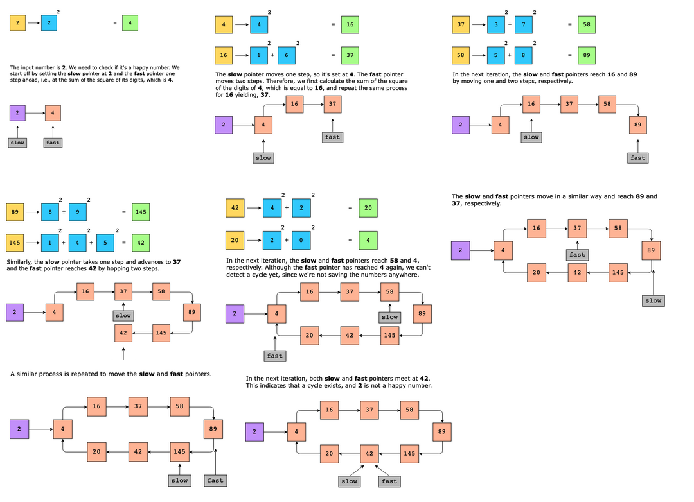

# Linked List Cycle

Check whether or not a linked list contains a cycle. If a cycle exists, return TRUE. Otherwise, return FALSE. The cycle means that at least one node can be reached again by traversing the next pointer.

Constraints:

Let n be the number of nodes in a linked list.

- 0 ≤ n ≤ 500
- −105 ≤ Node.data ≤ 105

## Solution

The naive approach is to traverse the linked list and store the current node in a set. At each iteration, we check if the current node is already present in the set. If it is, we’ve found a cycle and return TRUE. Otherwise, we add the node to the set. If the traversal has been completed, return FALSE, since we’ve reached the end of the linked list without encountering a cycle.

The time complexity is O(n), since we only traverse the linked list once, where nn represents the total number of nodes in a linked list. The space complexity of the naive approach is also O(n), since in the worst case, we store nn nodes in the set.

This problem can be solved efficiently using the fast and slow pointers technique, where the fast pointer moves two steps, and the slow pointer moves one step in the linked list.

If there is no cycle in the linked list, the fast pointer will reach the end of the linked list before the slow pointer. If there is a cycle, the fast pointer will eventually catch up to the slow pointer, since it is moving faster. When this happens, we know that we have a cycle in the linked list. The following steps can be performed to implement the algorithm above:

1. We initialize two pointers, fast and slow, which point to the head of the linked list.
2. We traverse the linked list using these two pointers. They move in the following way:
   - The slow pointer moves only one node forward in each iteration.
   - The fast pointer moves two nodes forward in each iteration, which means that it skips a node.
3. If the fast pointer becomes NULL, we have reached the end of the linked list. Since no cycle exists, return FALSE.
4. If both slow and fast pointers become equal to each other, return TRUE, since a cycle exists in the linked list.

TODO

### Time complexity

The time complexity of the algorithm is O(n), where nn is the number of nodes in the linked list.

### Space complexity

The space complexity for this algorithm is O(1).