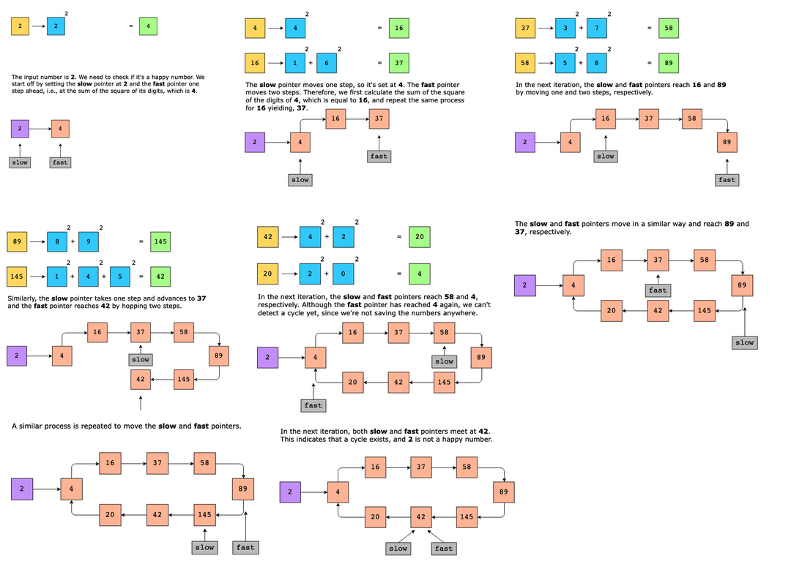

# Circular Array Loop

An input array, nums containing non-zero integers, is given, where the value at each index represents the number of places to skip forward (if the value is positive) or backward (if the value is negative). When skipping forward or backward, wrap around if you reach either end of the array. For this reason, we are calling it a circular array. Determine if this circular array has a cycle. A cycle is a sequence of indices in the circular array characterized by the following:

- The same set of indices is repeated when the sequence is traversed in accordance with the aforementioned rules.
- The length of the sequence is at least two.
- The loop must be in a single direction, forward or backward.

It should be noted that a cycle in the array does not have to originate at the beginning. A cycle can begin from any point in the array.

Constraints:

- 1 ≤ nums.length ≤ 10^4
- −5000 ≤ nums[i] ≤ 5000
- nums[i] != 0

## Solution

The naive approach is to traverse the whole array and check for each element whether we can form a cycle starting from each element or not. We’ll run a loop on every array element and keep track of the visited element using an additional array. We’ll check the condition for both the forward and backward cycles. If the direction of the cycle changes at any point, we’ll come out of that loop and continue verifying the loop condition for the remaining elements.

We get the required solution, but at what cost? The time complexity is O(n^2) as we run a loop on every array element. The space complexity is O(n) because we use extra space to keep track of the visited elements. If our array contains thousands of elements, we’ll need a lot of our memory resources to solve this problem.

We can use the fast and slow pointers to solve this problem with constant space complexity. The following steps are applied:

1. Move the slow pointer xx steps forward/backward, where xx is the value at the ith index of the array.
2. Move the fast pointer xx steps forward/backward, where xx is the value at ith index. Then, move fast pointer yy steps forward/backward, where yy is the value at xth index.
3. Return TRUE when both pointers meet at the same point.
4. If the direction changes after moving the slow or fast pointer or taking a step return to the same location, then follow the steps above for the next element of the array.
5. Return FALSE if we have traversed every element of the array without finding a loop.

TODO

### Time complexity

The time complexity of the algorithm is O(n^2), where nn is the number of nodes in the linked list.

### Space complexity

The space complexity for this algorithm is O(1).