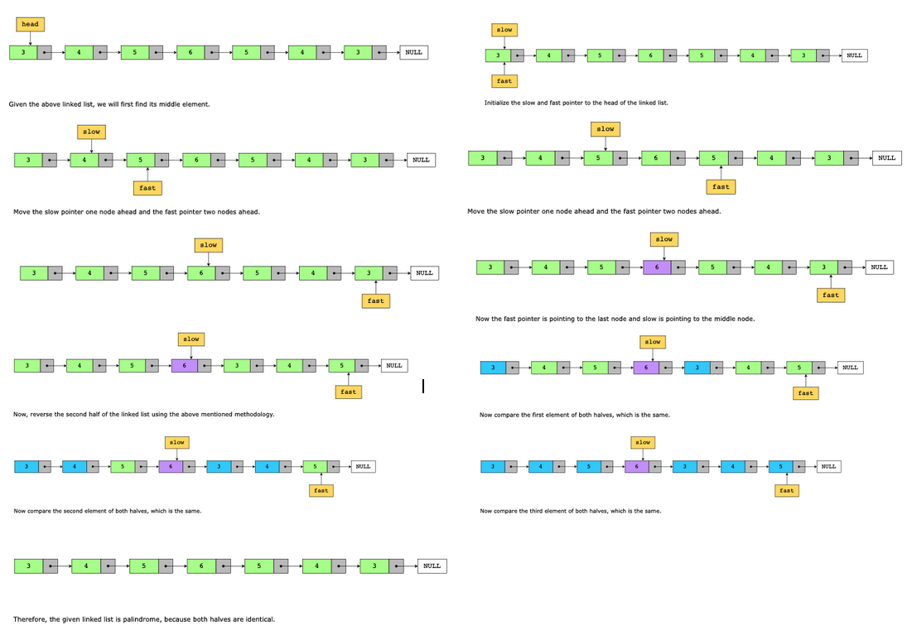

# Palindrome Linked List

Given the head of a linked list, your task is to check whether the linked list is a palindrome or not. Return TRUE if the linked list is a palindrome; otherwise, return FALSE.

> Note: The input linked list prior to the checking process should be identical to the list after the checking process has been completed.

Constraints:

Let n be the number of nodes in a linked list.

- 1 ≤ n ≤ 500
-  0 ≤ Node.value ≤ 9

## Solution

The fast and slow pointers technique helps determine whether a linked list is a palindrome or not, because it allows us to efficiently traverse the list and find the middle node in a single pass. We can do this in linear time and with constant extra space.

To determine whether a linked list is a palindrome, we first find the middle node of the linked list using the fast and slow pointers approach. Then, we will reverse the second half of the linked list, starting from the node after the middle node until the end of the list. Next, we will compare the first half with the second half.

If both halves of the list match, the linked list is a palindrome. Otherwise, it is not. In the end, we reverse the second half of the linked list again. This is done to revert it to the original structure of the linked list so that the input linked list is not modified by the palindrome checking process.

### Time complexity

The algorithm’s time complexity is O(n), where nn is the total number of nodes in the linked list.

### Space complexity

The space complexity of the algorithm above is O(1), because it does not use any extra space in memory.