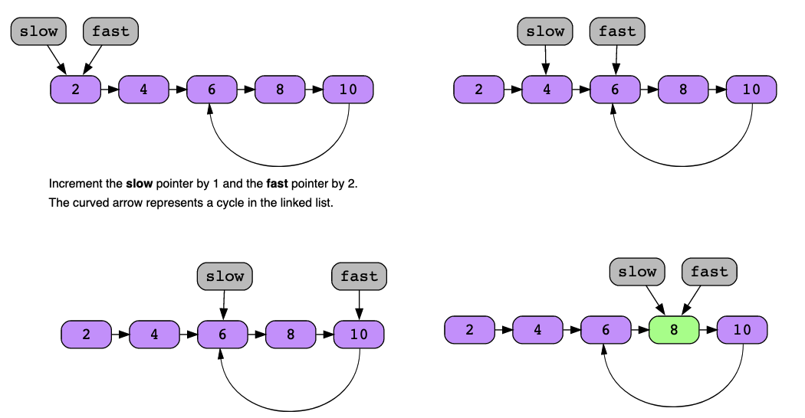
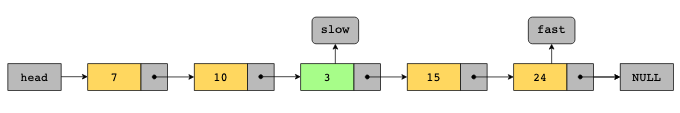
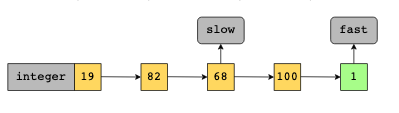

# Fast and Slow Pointers

The fast and slow pointers pattern uses two pointers to traverse an iterable data structure at different speeds. It’s usually used to identify distinguishable features of directional data structures, such as a linked list or an array.

The pointers can be used to traverse the array or list in either direction, however, one moves faster than the other. Generally, the slow pointer moves forward by a factor of one, and the fast pointer moves by a factor of two in each step. However, the speed can be adjusted according to the problem statement.

Unlike the two pointers approach, which is concerned with data values, the fast and slow pointers approach is used to determine data structure traits using indices in arrays or node pointers in linked lists. The approach is commonly used to detect cycles in the given data structure, so it’s also known as Floyd’s cycle detection algorithm.

The key idea is that the pointers start at the same location, but they move forward at different speeds. If there is a cycle, the two are bound to meet at some point in the traversal. To understand the concept, think of two runners on a track. While they start from the same point, they have different running speeds. If the race track is a circle, the faster runner will overtake the slower one after completing a lap. On the other hand, if the track is straight, the faster runner will end the race before the slower one, hence never meeting on the track again. The fast and slow pointers pattern uses the same intuition.

## Conditions

- Either as an intermediate step, or as the final solution, the problem requires identifying:
  - the first x % of the elements in a linked list, or,
  - the element at the k-way point in a linked list, for example, the middle element, or the element at the start of the second quartile, etc.
  - the k^th last element in a linked list

- Solving the problem requires detecting the presence of a cycle in a linked list.
- Solving the problem requires detecting the presence of a cycle in a sequence of symbols.

## Examples

- Find the middle node of a linked list: Set the fast and slow pointers initially equal to the head of the linked list. Traverse the linked list by moving the slow pointer one node forward, and the fast pointer two nodes forward. Once the fast pointer reaches the last node, the slow pointer has reached the middle node of the linked list.

- Determine if an integer is a happy number: A step represents calculating the sum of the squares of the individuals digits of the integer. The slow pointer moves one step, and the fast pointer moves two steps. This process is repeated until either the fast pointer become equal to 1, in which case the initial integer is a happy number. Otherwise, if the fast and slow pointers meet, a cycle exists in the pattern of numbers, so the initial integer is not a happy number.

### Real-world problems

Many problems in the real world use the fast and slow pointers pattern. Let’s look at some examples.

- Symlink verification: Fast and slow pointers can be used in a symlink verification utility in an operating system. A symbolic link, or symlink, is simply a shortcut to another file. Essentially, it’s a file that points to another file. Symlinks can easily create loops or cycles where shortcuts point to each other. To avoid such occurrences, a symlink verification utility can be used. Similar to a linked list, fast and slow pointers can detect a loop in the symlinks by moving along the connected files or directories at different speeds.
- Compiling an object-oriented program: Usually, programs are not contained in a single file. Particularly, for large applications, modules can be divided into different files for better maintenance. Dependency relationships are then defined to specify the order of compilation for these files. However, sometimes, there might be cyclic dependencies that can lead to an error. Fast and slow pointers can be used to identify and remove these cycles for seamless compilation and execution of the program.
