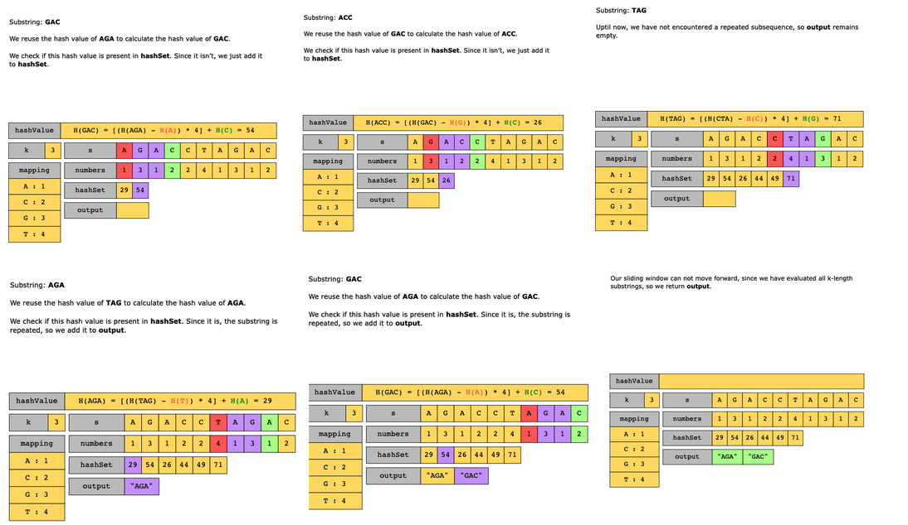

# Repeated DNA Sequences

Given a string, s, that represents a DNA subsequence, and a number k, return all the contiguous subsequences (substrings) of length k that occur more than once in the string. The order of the returned subsequences does not matter. If no repeated substring is found, the function should return an empty set.

> The DNA sequence is composed of a series of nucleotides abbreviated as A, C, G, and T. For example, ACGAATTCCG is a DNA sequence. When studying DNA, it is useful to identify repeated sequences in it.

Constraints:

- 1 ≤ s.length ≤ 104
- s[i] is either A, C, G, or T.
- 1 ≤ k ≤ 10

## Solution

A naive approach would be to iterate through the input DNA sequence and add all the unique substrings of length k to a set. If a substring is already present in a set, it is a repeated substring.

The time complexity of this approach is O((n−k)×k), where n is the length of the input sequence and k is the size of each contiguous subsequence we consider. This is because we iterate over (n−k+1) substrings of length k, and at each iteration, the time taken to generate a k-length substring is O(k).

The space complexity of this approach is O((n−k)×k), since in the worst case, our set can contain (n−k+1) elements, and at each iteration of the traversal, we are allocating memory to generate a new k-length substring.

The problem can be optimized using a sliding window approach. We use the Rabin-Karp algorithm that utilizes a sliding window with rolling hash for pattern matching.

Here’s the basic idea of the algorithm:

- We traverse the string by using a sliding window of length k, which slides one character forward on each iteration.
- On each iteration, we compute the hash of the current k-length substring in the window.
- We check if the hash is already present in the set.
  - If it is, the substring is repeated, so we add it to the output.
  - Otherwise, the substring has not yet been repeated, so we add the computed hash to the set.
- We repeat the above process for all k-length substrings by sliding the window one character forward on each iteration.
- After all k-length substrings have been evaluated, we return the output.

There are multiple approaches for computing hash values, and the choice of the hash function can impact the algorithm’s time complexity.

### Step-by-step solution construction

The solution to this problem can be divided into the following six main parts:

1. Iterate over all k-length substrings.
2. Compute the hash value for the contents of the window.
3. Add this hash value to the set that keeps track of the hashes of all substrings of the given length.
4. Move the window one step forward and compute the hash of the new window using the rolling hash method.
5. If the hash value of a window has already been seen, the sequence in this window is repeated, so we add it to the output array.
6. Once all substrings have been evaluated, return the output array.

### Time complexity

#### Average case

The average case time complexity of this solution is O(n), where n is the length of the input string. It is calculated as follows:

- Time taken to populate the numbers array: O(n).
- Time taken to traverse all the k-length substrings: O(n−k+1).
- Time taken to calculate the hash value of a k-length substring: O(1).

So, the dominating time complexity becomes O(n).

#### Worst case

To understand the worst case time complexity of this solution, consider the input string “AAAAAAAA” with k=2. This combination of inputs ensures that a repeated sequence “AA” is detected and added to the output each time the window slides forward. Therefore, we must generate a k-length substring on each (n−k+1) iteration of the loop. The time to generate a k-length substring is O(k). Therefore, the overall time complexity becomes O((n−k)×k).

### Space complexity

The space complexity of this solution is O(n). It is calculated as follows:

- Space occupied by the mapping hash map: O(1).
- Space occupied by the numbers array: O(n).
- Space occupied by the hashSet set: O(n−k+1).

So, the dominating space complexity becomes O(n).