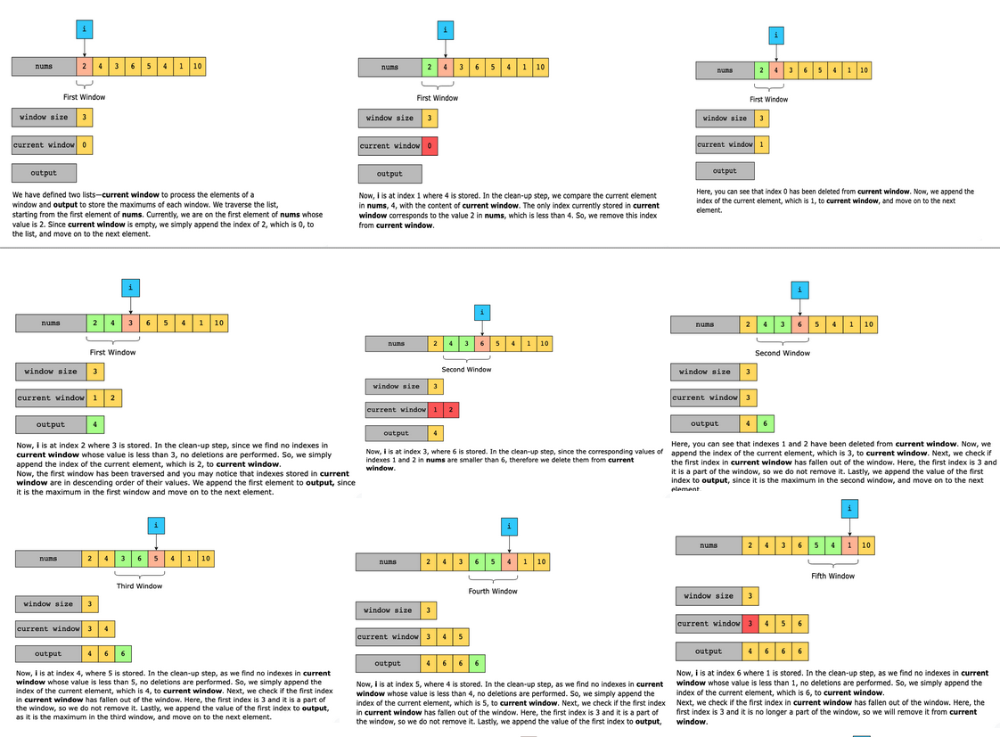
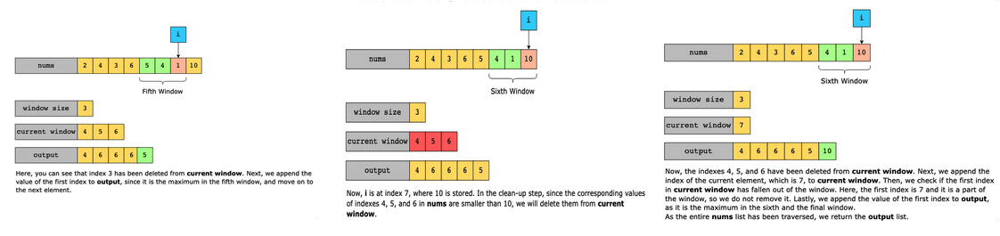

# Find Maximum in Sliding Window

Given an integer list, nums, find the maximum values in all the contiguous subarrays (windows) of size w.

> Note: If the window size is greater than the array size, we consider the entire array as a single window.

Constraints:

- 1 ≤ arr.length ≤ 103
- −10^4 ≤ arr[i] ≤ 104
- 1 ≤ w

## Solution

A naive approach is to slide the window over the input list and find the maximum in each window separately. Here’s how the algorithm works:

- We create an array, current_window to store the contents of the current ww-length window.
- We iterate over the first window and add its elements to current_window.
- We linearly calculate the maximum element in current_window, and add it to the output array.
- In each subsequent iteration, we remove the first element of current_window and then append the incoming element in the window to it. We then again calculate the maximum linearly and add it to the output array. This process is repeated for each window.
- Finally, when we have traversed the entire input array, we return the output array containing the maximums of all (n−w+1) windows.

The time complexity of this approach is O(n×w). Since we only iterate over the input list once to find all the windows, the time complexity of this part will be O(n). Furthermore, removing the first element, appending the outgoing element, and finding the maximum element in the window take O(w) time.

The space complexity of this approach is O(w), since we maintain an array for the window.

Our first solution uses the sliding window technique to solve the problem. However, there is much room for improvement. 

### Step-by-step solution construction

To reduce the time complexity to O(n), we will apply the following optimization:

1. First, we validate the inputs. If the input list is empty, we return an empty list, and if the window size is greater than the list length, we set the window to be the same size as the input list.
2. Then, we process the first ww elements of the input list. We will use a deque to store the indexes of the candidate maximums of each window.
3. For each element, we perform the clean-up step, removing the indexes of the elements from the deque whose values are smaller than or equal to the value of the element we are about to add to the deque. Then, we append the index of the new element to the back of the deque.
4. After the first ww elements have been processed, we append the element whose index is present at the front of the deque to the output list, since it is the maximum in the first window.
5. After finding the maximum in the first window, we iterate over the remaining input list. For each element, we repeat Step 3 as we did for the first ww elements.
6. Additionally, in each iteration, before appending the index of the current element to the deque, we check if the first index in the deque has fallen out of the current window. If so, we remove it from the deque.
7. Finally, we return the list containing the maximum elements of each window.

### Time complexity

The input parameters of the function are a list of integers and an integer specifying the size of the window. In the discussion that follows, we will use nn to represent the size of the list of integers, and ww to represent the size of the window.

To get a clearer understanding of the time complexity of our solution, we need to consider the different ways in which the values in the input list change. The values in the list can be:

1. Strictly increasing
2. Strictly decreasing
3.  Constant
4.  Mixed, i.e, increasing, decreasing, constant, then decreasing again, then constant, then increasing, then constant and then decreasing

On the surface, we might expect our solution to take O(n∗w), but that would be no better than the naive solution. When we look closer at our solution, it comes down to figuring out how many times the clean-up loop actually runs. This is the loop that pops all elements from the deque that are smaller than the new element in the window.

Let’s consider the first case when the values in the array are strictly increasing. The first time the window moves forward, the new element is larger than all the other elements in the deque. Therefore, we have to perform the removeLast() operation ww times. Then, in all the subsequent steps, the removeLast() operation is performed only once, since the deque will only contain one element from this point onward. The number of subsequent steps is n−wn−w. So, the complexity in this case is O(w+n−w), that is, O(n).

In the second case, every time the window moves forward, the new element is smaller than all the other elements in the deque. Therefore, the removeFirst() operation is only performed once in every subsequent step to remove the element that does not fall in the window anymore. So, the time complexity in this case is O(n−w+1), that is, O(n−w).

In the third case, the same behavior is repeated as in the second case, so the time complexity is O(n−w) here, too.

Finally, in the fourth case, the time complexity for increasing values as well as decreasing and constant values will be the same as explained above. The only other situation is when the values increase after staying constant, or right after a sequence of decreasing numbers. In either case, we incur a cost of O(w), since we clean up the deque using the removeLast() operation. If there is an increase in the value after every ww elements, we pay the O(w) cost to clean up the deque. This can only happen n/w times. The cost of filling up the deque while the elements are constant or decreasing will be O(w). So, the total cost with such data will be O((w+w)(n/w)), that is, O(2w(n/w)) or O(n).

Hence, the time complexity of the solution, considering the worst of these four cases, is O(n).

### Space complexity

The space complexity of this solution is O(w), where w is the window size.