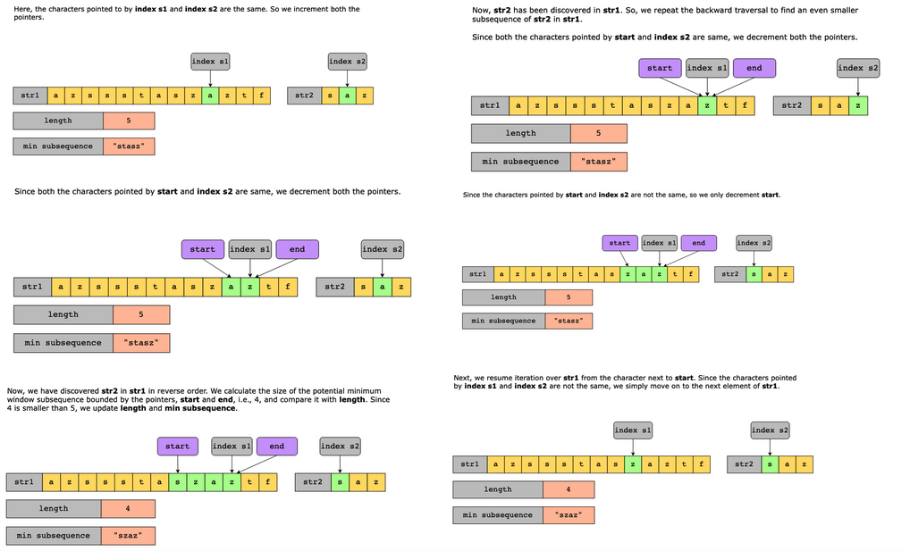

# Minimum Window Subsequence

Given two strings, str1 and str2, find the shortest substring in str1 such that str2 is a subsequence of that substring.

A substring is defined as a contiguous sequence of characters within a string. A subsequence is a sequence that can be derived from another sequence by deleting zero or more elements without changing the order of the remaining elements.

Let’s say you have the following two strings:

- str1 = “abbcbabbcb”
- str2 = “acac”

In this example, “abbcabbc” is a substring of str1, from which we can derive str2 simply by deleting both the instances of the character bb. Therefore, str2 is a subsequence of this substring. Since this substring is the shortest among all the substrings in which str2 is present as a subsequence, the function should return this substring, that is, “abbcabbc”.
 
- If there is no substring in str1 that covers all characters in str2, return an empty string.
- If there are multiple minimum-length substrings that meet the subsequence requirement, return the one with the left-most starting index.

Constraints:

- 1 ≤ str1.length ≤ 2×10^3
- 1 ≤ str2.length ≤ 100
- str1 and str2 consist of uppercase and lowercase English letters.

## Solution

The naive approach would be to generate all possible substrings of str1 and then check which substrings contain str2 as a subsequence. Out of all the substrings in str1 that contain str2 as a subsequence, we’ll choose the one with the shortest length. Now, let’s look at the cost of this solution. We need two nested loops to get all possible substrings and another loop to check whether each substring contains all the required characters. This brings the time complexity to O(n^3). Since we’re not using any extra space, the space complexity is O(1).

To eliminate the extra traversals of the substrings, we use the sliding window approach. With this approach, we only consider the substrings that we are sure contain all the characters of str2 in the same order. This problem can be conveniently solved using the sliding window pattern. The idea is to keep track of whether the subsequence has been found or not and to select the shortest subsequence from str1.

To reduce the time complexity, we will apply the following optimization:

1. Initialize two indexes, indexS1 and indexS2, to zero for iterating both strings.
2. If the character pointed by indexS1 in str1 is the same as the character pointed by indexS2 in str2, increment both pointers. Otherwise, only increment indexS1.
3. Once indexS2 reaches the end of str2, initialize two new indexes (start and end). With these two indexes, we’ll slide the window backward.
4. Set start and end to indexS1.
5. If the characters pointed to by indexS2 and start are the same, decrement both of them. Otherwise, only decrement start.
6. Once, str2 has been discovered in str1 in the backward direction, calculate the length of the substring.
7. If this length is less than the current minimum length, update the minSubLen variable and the minSubsequence string.
8. Resume the search in the forward direction from start +1+1 in str1.
9. Repeat until indexS1 reaches the end of str1.

### Time complexity

The outer loop iterates over the string str1, so the time complexity of this loop will be O(n), where nn is the length of string str1. Inside this loop, there is a while loop that is used to iterate back over the window once all the characters of str2 have been found in the current window. The time complexity of this loop will be O(m), where mm is the length of string str2. Therefore, the overall time complexity of this solution is O(n×m)O(n×m). For example, when str1 = “aaaaa” and str2 = “aa”, it takes O(n×m) time.

Let’s consider another example where the inner loop travels for more than O(m) iterations. For example, when str1 = “abcdefg” and str2 = “af”. When all characters of str2 have been found (using outer loop in O(n) time), the inner loop iterates back from ‘f’ till ‘a’, taking O(n) time. After that, the outer loop will start from ‘b’ and traverse all characters till the end of str1 without initiating the inner loop. This is because the outer loop will never find a subsequence containing str2. This will take O(n) time. Therefore, the total time complexity in this case will be O(n+n+n), which is O(n).

Therefore, the worst-case time complexity of this algorithm is O(n×m).

### Space complexity

Since we are not using any extra space apart from a few variables, the space complexity is O(1).