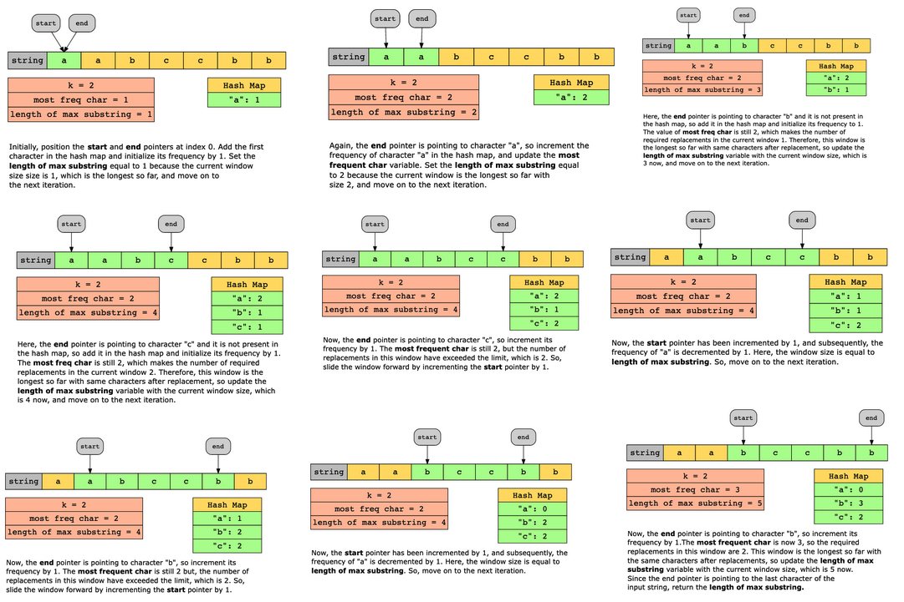

#  Longest repeating character replacement

Given a string, s, of lowercase English characters and an integer, k, return the length of the longest substring after replacing at most k characters with any other lowercase English character so that all the characters in the substring are the same.

Constraints:

- 1 ≤ str1.length ≤ 10^5
- s consists of only lowercase English characters
- 0 ≤ k ≤ s.length

## Solution

The naive approach would be to iterate over all the possible substrings. To find all the possible substrings, we iterate over the entire string, character by character, and for each character, we form all the possible substrings starting from that character. Then, for each substring, we have a nested loop to iterate over it in order to calculate the number of required replacements. If in a substring, the number of required replacements is less than or equal to k and it is the longest so far, we store the length of the substring in a variable that maintains the length of the longest substring containing the same character. The time complexity of this approach will be O(n^3), where nn is the length of the input string.

To reduce the time complexity, we will apply the following optimization with sliding window:

1. We iterate over the input string using two pointers.
2. In each iteration:  
        a. If the new character is not present in the hash map, we add it. Otherwise, we increment its frequency by 1.  
        b. We slide the window one step forward if the number of replacements required in the current window has exceeded our limit.  
        c. If the current window is the longest so far, then we update the length of the longest substring that has the same character.  
3. Finally, we return the length of the longest substring with the same character after replacements.

### Time complexity

The time complexity of the solution is O(n), where n is the length of the input string because we iterate over the input string only once.

### Space complexity

The space complexity of the solution is O(1), since we will be storing the frequency of 26 characters at most in the hash map.