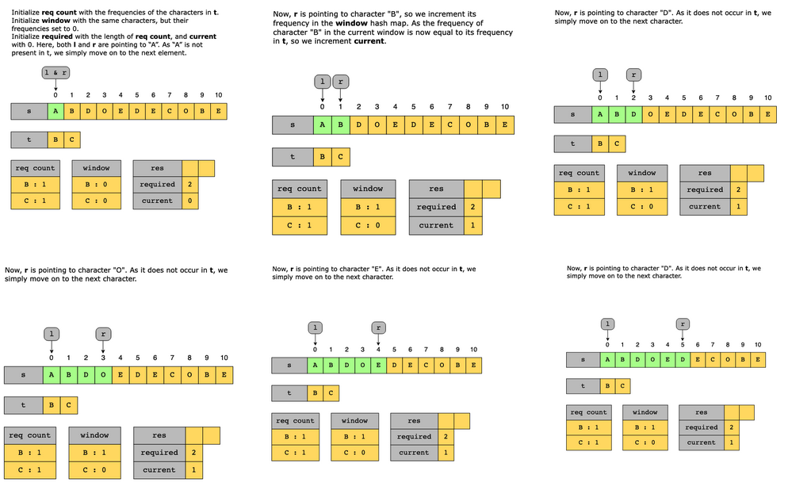
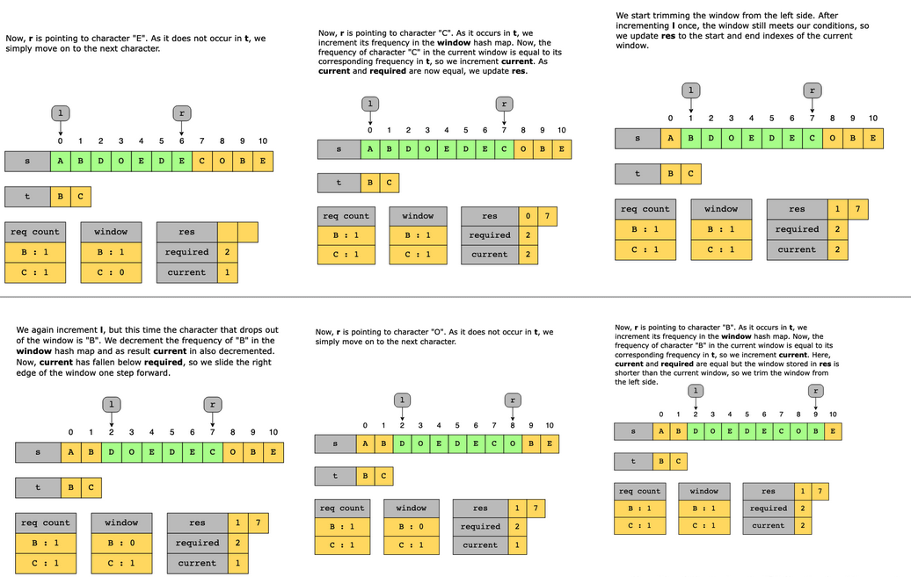
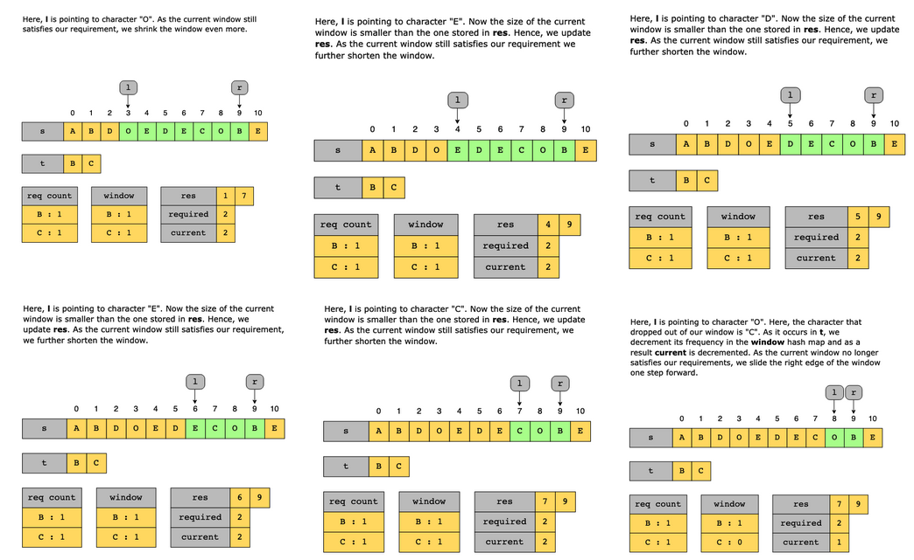
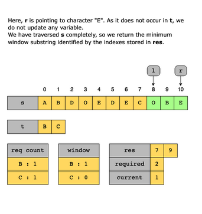

#  Minimum Window Substring

Given two strings, s and t, find the minimum window substring in s, which has the following properties:

1. It is the shortest substring of s that includes all of the characters present in t.
2. It must contain at least the same frequency of each character as in t.
3. The order of the characters does not matter here.

    Note: If there are multiple valid minimum window substrings, return any one of them.

Constraints:

- Strings s and t consist of uppercase and lowercase English characters.
- 1 ≤ s.length, t.length ≤ 10^3

## Solution

The naive approach would be to find all possible substrings of s and then identify the shortest substring that contains all characters of t with corresponding frequencies equal to or greater than those in t.

To find all possible substrings, we will iterate over s one character at a time. For each character, we will form all possible substrings starting from that character.

We will keep track of the frequencies of the characters in the current substring. If the frequencies of the characters of t in the substring are equal to or greater than their overall frequencies in t, save the substring given that the length of this substring is less than the one already saved. After traversing s, return the minimum window substring.

The time complexity of this approach will be O(n^2), where nn is the length of s. The space complexity of this approach will be O(n), the space used in memory to track the frequencies of the characters of the current substring.

To reduce the time complexity, we will apply the following optimization with sliding window:

- We validate the inputs. If t is an empty string, we return an empty string.
- Next, we initialize two hash maps: reqCount, to save the frequency of characters in t, and window, to keep track of the frequency of characters of t in the current window. We also initialize a variable, required, to hold the number of unique characters in t. Lastly, we initialize current which keeps track of the characters that occur in t whose frequency in the current window is equal to or greater than their corresponding frequency in t. 
- Then, we iterate over s and in each iteration we perform the following steps:
  - If the current character occurs in t, we update its frequency in the window hash map.
  - If the frequency of the new character is equal to its frequency in reqCount, we increment current.
  - If current is equal to required, we decrease the size of the window from the start. As long as current and required are equal, we decrease the window size one character at a time, while also updating the minimum window substring. Once current falls below required, we slide the right edge of the window forward and move on to the next iteration.
- Finally, when s has been traversed completely, we return the minimum window substring.

### Time complexity

In the average-case scenario, each hash map operation will cost O(1). So, the time complexity for the solution shown above is O(n+m), where nn and mm are the lengths of the strings s and t, respectively. This is because we’re accessing each element of s just once. For all practical purposes, this is the time complexity of this solution.

In the worst case, each hash map operation will cost O(m). Hence, the overall time complexity would be O(m+(n×m)).

### Space complexity

Since the characters in t are limited to uppercase and lowercase English letters, there is a maximum of 52 possible characters. Therefore, the size of the reqCount and window hash maps will be at most 52, regardless of the length of t. Therefore, the space complexity of this solution will be O(1).