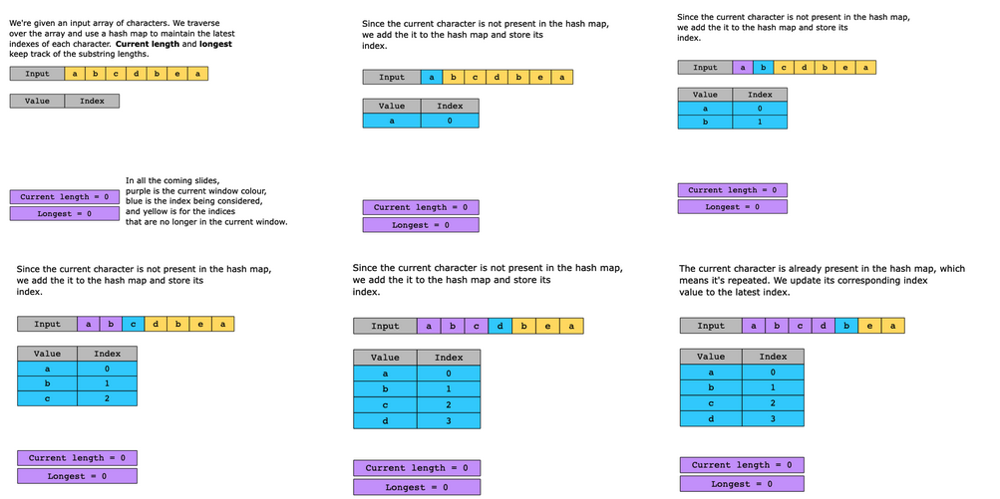
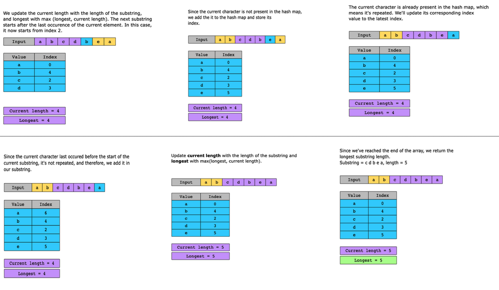

# Longest Substring without Repeating Characters

Given a string, str, return the length of the longest substring without repeating characters.

Constraints:

- 1 ≤ str.length ≤ 5 × 10^4
- str consists of English letters, digits, symbols, and spaces.

## Solution

The naive approach is to explore all possible substrings. For each substring, we check whether any character in it is repeated. After checking all the possible substrings, the substring with the longest length that satisfies the specified condition is returned.

The total time complexity of this solution is O(n^3). To explore all possible substrings, the time complexity is O(n^2), and to check whether all the characters in a substring are unique or not, the time complexity can be approximated to O(n). So, the total time complexity is O(n^2)∗O(n)=O(n^3). The space complexity of this naive approach is O(min(m,n)), where m is the size of the character set and n is the size of the string.

To reduce the time complexity, we will apply the following optimization with sliding window:

1. Traverse the input string.
   1. Use a hash map to store elements along with their respective indexes.  
   a. If the current element is present in the hash map, check whether it’s already present in the current window. If it is, we have found the end of the current window and the start of the next. We check if it’s longer than the longest window seen so far and update it accordingly.  
   b. Store the current element in the hash map with the key as the element and the value as the current index.  
2. At the end of the traversal, we have the length of the longest substring with all distinct characters.

### Time complexity

We have to iterate over all the n elements in the string. Therefore, the time complexity is O(n).

### Space complexity

We need extra space to store the last occurrence of each element. In the worst-case scenario, all of the elements can be unique and we need to store all nn elements. Therefore, the space complexity will be O(n).