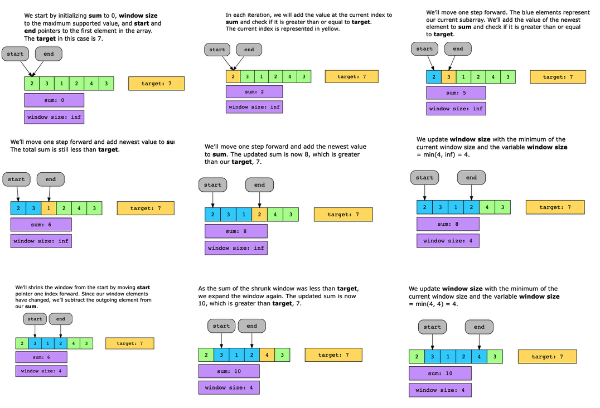
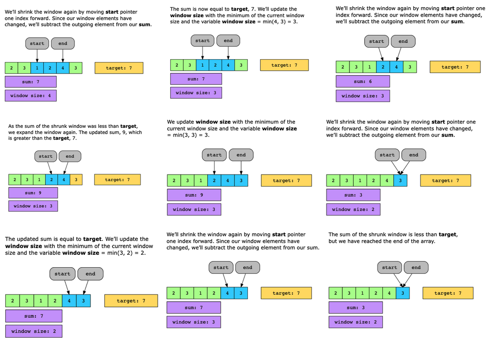

# Longest Substring without Repeating Characters

Given an array of positive integers, nums, and a positive integer, target, find the minimum length of a contiguous subarray whose sum is greater than or equal to the target. If no such subarray is found, return 0.

Constraints:

- 1 ≤ target ≤ 10^9
- 1 ≤ nums.length ≤ 10^5
- 1 ≤ nums[i] ≤ 10^4

## Solution

The idea is to traverse the array using a sliding window, calculate the sum of elements in it, and compare the sum with the target value. If the sum is greater than or equal to the target value, store the size of this window. Repeat this process to find the minimum size subarray.

We perform the following steps to implement the algorithm:

1. We start by initializing a variable, windowSize, with positive infinity to store the size of the minimum subarray. In addition, we initialize sum with 0.
2. We use the start and end variables to track the left and right end of the subarray, respectively. Initially, we set both variables to 0.
3. We slide the window over the input array using these two variables. In each iteration, we increment end and add the new element of the window into the sum. If sum is greater than or equal to target, we increment start.
4. If sum exceeds or equals the target, we compare the current subarray size with windowSize. The smaller of the two values will be stored in windowSize.
5. We repeat steps 3 and 4 to find the smallest subarray.
6. Finally, if windowSize is positive infinity, we come to know that there was no subarray whose sum was equal to or greater than target. Therefore, we return 0. Otherwise, we return windowSize as the length of the minimum size subarray.

### Time complexity

The time complexity of this solution is O(n).

### Space complexity

The space complexity of this solution is O(1), since we are not using any extra space.