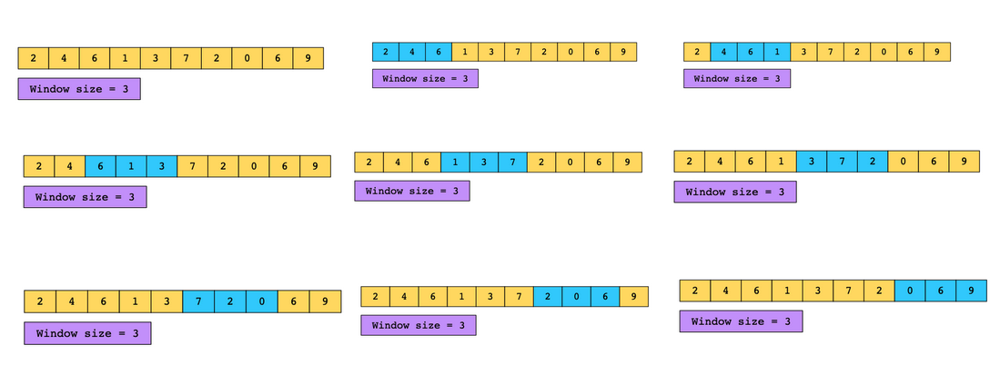
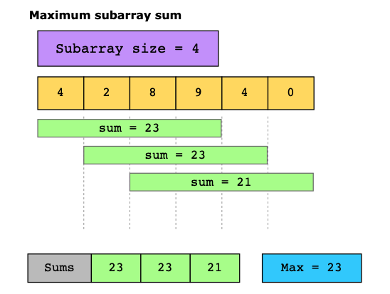
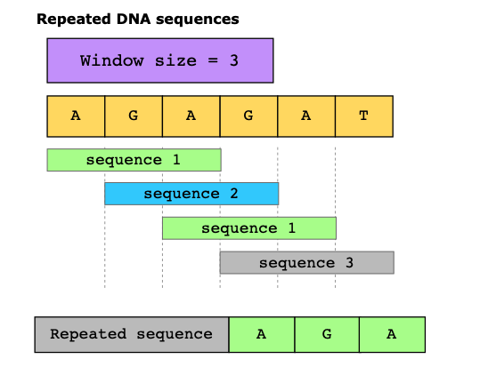

# Sliding Window

The sliding window pattern is used to process sequential data by maintaining a moving subset of elements, called a window. The pattern is aimed at reducing the use of nested loops in an algorithm. It may be viewed as a variation of the two pointers pattern, with the pointers being used to set the window bounds.

A window is a sublist formed over a part of an iterable data structure. It can be used to slide over the data in chunks corresponding to the window size. The sliding window pattern allows us to process the data in segments instead of the entire list. The segment or window size can be set according to the problem’s requirements. For example, if we have to find three consecutive integers with the largest sum in an array, we can set the window size to 3. This will allow us to process the data three elements at a time.

Why is this method more efficient? It isn’t if, for each window, we iterate over all the elements of the window because that gives us the same O(kn) time complexity.

Instead, what if we focused on the element entering the window and the one leaving it? For example, after calculating the sum of the first three elements, we move the window one step forward, subtract the element that is no longer in the window from the sum, and add the new element that has entered it. Next we check if the new sum is greater than the first. If it is, we update the max sum found so far. Now, each time we move the window forward, we perform at most four operations, reducing the time complexity to O(4n), that is, O(n).

The following illustration shows how the window moves along an array:

## Conditions

- The problem requires repeated computations on a contiguous set of data elements (a subarray or a substring), such that the window moves across the input array from one end to the other. The size of the window may be fixed or variable, depending on the requirements of the problem. The repeated computations may be a direct part of the final solution, or they may be intermediate steps building up towards the final solution.
- The computations performed every time the window moves take O(1) time or are a slow-growing function, such as log, of a small variable, say k, where k≪n.

## Examples

- Maximum subarray sum:

- Repeated DNA sequences:

### Real-world problems

Many problems in the real world use the sliding window pattern. Let’s look at some examples.

- Telecommunications: Find the maximum number of users connected to a cellular network’s base station in every k-millisecond sliding window.
- E-commerce: Given a dataset of product IDs in the order they were viewed by the user and a list of products that are likely to be similar, find how many times these products occur together in the dataset.
- Video streaming: Given a stream of numbers representing the number of buffering events in a given user session, calculate the median number of buffering events in each one-minute interval.
- Social media content mining: Given the lists of topics that two users have posted about, find the shortest sequence of posts by one user that includes all the topics that the other user has posted about.
