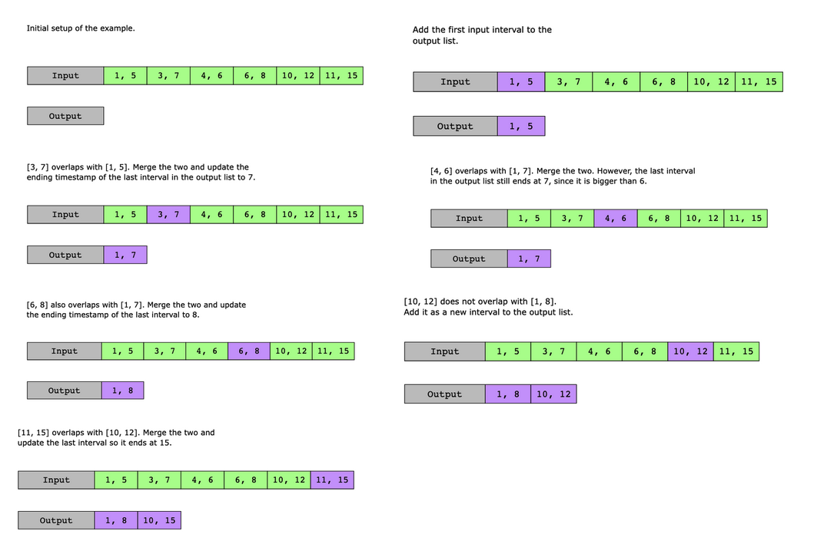

# Merge Intervals

We are given an array of closed intervals, intervals, where each interval has a start time and an end time. The input array is sorted with respect to the start times of each interval. For example, intervals = [ [1,4], [3,6], [7,9] ] is sorted in terms of start times 1, 3, and 7.

Your task is to merge the overlapping intervals and return a new output array consisting of only the non-overlapping intervals.

Constraints:

- 1 ≤ intervals.length ≤ 10^4
- intervals[i].length =2
- 0 ≤ start time ≤ end time ≤ 10^4

## Solution

The naive approach is to start from the first interval in the input list and check for any other interval in the list that overlaps it. If there is an overlap, merge the other interval into the first interval and then remove the other interval from the list. Repeat this for all the remaining intervals in the list.

In the worst-case scenario, where all intervals overlap with each other, we would need to traverse the input list multiple times to merge all the overlapping intervals. If we have nn intervals in the input list, the time complexity to traverse and merge these would be O(n^2). However, the space complexity for this solution is O(1), since we are not using any extra processing space.

The solution to this problem with merge intervals can be divided into the following two parts:

1. Insert the first interval from the input list into the output list.
2. Traverse the input list of intervals. For each interval in the input list, we do the following:  
   a. If the input interval is overlapping with the last interval in the output list, merge these two intervals and replace the last interval of the output list with this merged interval.  
   b. Otherwise, add the input interval to the output list.

### Time complexity

The time complexity of this solution is O(n), where n is the number of intervals in the input list.

### Space complexity

The space complexity of this solution is O(n).
