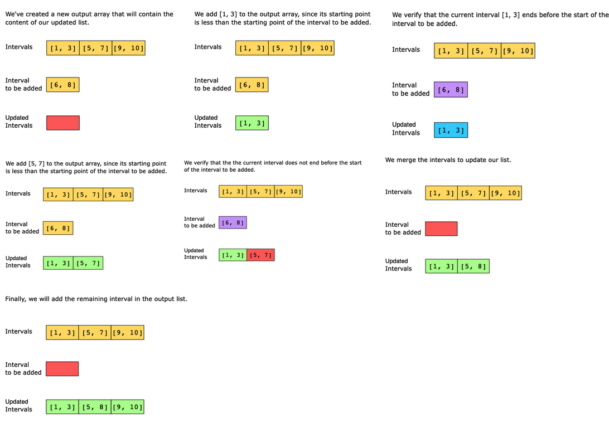

# Insert Interval

Given a sorted list of nonoverlapping intervals and a new interval, your task is to insert the new interval into the correct position while ensuring that the resulting list of intervals remains sorted and nonoverlapping. Each interval is a pair of nonnegative numbers, the first being the start time and the second being the end time of the interval.

Constraints:

- 0 ≤ existingIntervals.length ≤ 10^4
- existingIntervals[i].length, newInterval.length == 2
- 0 ≤ start time, end time ≤ 10^4
- The first number should always be less than the second number in each interval.
- The list of intervals is sorted in ascending order based on the first element in every interval.

## Solution

The naive approach to this problem is to iterate through the existing intervals. For each interval, we check if the current interval overlaps the existing interval. If an overlap is detected, the intervals are merged by adjusting the start and end times. Additionally, a flag is set to TRUE, indicating that the new interval is added to the existing intervals. After iterating through all existing intervals, if the flag remains FALSE, the new interval does not overlap with any existing interval. In such a case, the new interval is appended to the end of the output list. Finally, the output list is sorted based on the start times of the intervals to ensure that the new interval is placed in the correct order.

The time complexity is O(nlog(n)).

We can apply the merge intervals pattern with the following optimization steps:

- Append all intervals occurring before the new interval to the output list until we find an interval that starts after the starting point of the new interval.
- If there is an overlap between the last interval in the output list and the new interval, merge them by updating the end value of the last interval. Otherwise, append the new interval to the output list.
- Continue iterating through the remaining intervals and merge the overlapping intervals with the last interval in the output list.
- Return the final output list containing the merged intervals.

### Time complexity

The time complexity is O(n), where n is the number of intervals in the input list. This is because we iterate through the list once, checking and merging intervals as necessary.

### Space complexity

The space complexity is O(1), since we only use constant space other than the input and output data structures.