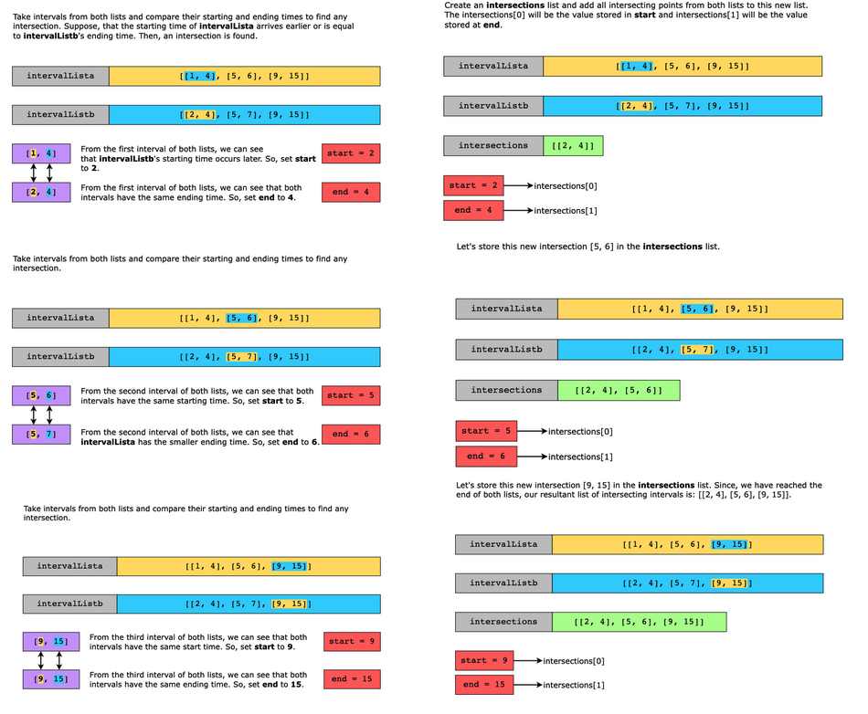

# Inverval List Intersections

For two lists of closed intervals given as input, intervalLista and intervalListb, where each interval has its own start and end time, write a function that returns the intersection of the two interval lists.

For example, the intersection of [3,8] and [5,10] is [5,8].

Constraints:

- 0 ≤ intervalLista.length, intervalListb.length ≤1000
- 0 ≤ start[i] << end[i] ≤ 10^9, where ii is used to indicate intervalLista
- end[i] << start[i + 1]
- 0 ≤ start[j] << end[j] ≤ 10^9, where jj is used to indicate intervalListb
- end[j] << start[j + 1]

## Solution

The naive approach for this problem is to use a nested loop for finding intersecting intervals.

- The outer loop will iterate for every interval in intervalLista and the inner loop will search for any intersecting interval in the intervalListb.
- If such an interval exists, we add it to the intersections list.

The time complexity for this naive approach will be O(n^2) since we are using nested loops.

This problem shares two features with the merge intervals pattern: the lists of intervals are sorted and the result requires comparing intervals to check overlap. Taking advantage of the sorted array of the lists, we can safely compare pairs of intervals (one from List A and one from List B), knowing that after every comparison, we need only move forward in the lists, without having to re-check either list from the start.

The algorithm to solve this problem is as follows:

- Compare the starting and ending times of a given interval from A and B.
- If the start time of the current interval in A is less than or equal to the end time of the current interval in B, or vice versa, we have found an intersection. Add it to a resultant list.
- Move forward in the list whose current interval ends earlier and repeat comparison and moving forward steps to find all intersecting intervals.
- Return the resultant list of intersecting intervals.

### Time complexity

The time complexity is O(n+m), where nn and mm are the number of meetings in intervalLista and intervalListb, respectively.

### Space complexity

The space complexity is O(1) as only a fixed amount of memory is consumed by a few temporary variables for computations performed by the algorithm.