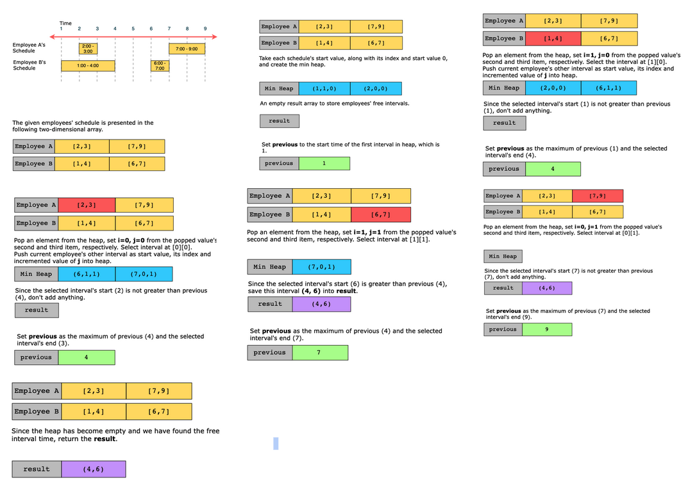

# Employee Free Time

You’re given a list containing the schedules of multiple employees. Each person’s schedule is a list of non-overlapping intervals in sorted order. An interval is specified with the start and end time, both being positive integers. Your task is to find the list of finite intervals representing the free time for all the employees.

Constraints:

- 1 ≤ schedule.length , schedule[i].length ≤ 50
- 0 ≤ interval.start < interval.end ≤ 10^8, where interval is any interval in the list of schedules.

## Solution

We find all common free time intervals by merging all of the intervals and finding out whether there are any gaps or intervals available between the time slots.

We use the following variables in our solution:

- previous: Stores the end time of the previously processed interval.
- i: Stores the employee’s index value.
- j: Stores the interval’s index of the employee, i.
- result: Stores the free time intervals.

The steps of the algorithm are given below:

- We store the start time of each employee’s first interval along with its index value and a value 0 into a min-heap.
- We set previous to the start time of the first interval present in a heap.
- Then we iterate a loop until the heap is empty, and in each iteration, we do the following:
  - Pop an element from the min-heap and set i and j to the second and third values, respectively, from the popped value.
  - Select the interval from input located at i,j.
  - If the selected interval’s start time is greater than previous, it means that the time from previous to the selected interval’s start time is free. So, add this interval to the result array.
  - Now, update the previous as max(previous,end time selected interval).
  - If the current employee has any other interval, push it into the heap.
- After all the iterations, when the heap becomes empty, return the result array.

### Time complexity

The time complexity of the solution is O(n⋅logk), where k is the number of employees and n is the number of intervals. This is because the heap can contain a maximum of k elements.

### Space complexity

We use a heap in the solution, which can have a maximum of k elements. Hence, the space complexity of this solution is O(k), where k is the number of employees.