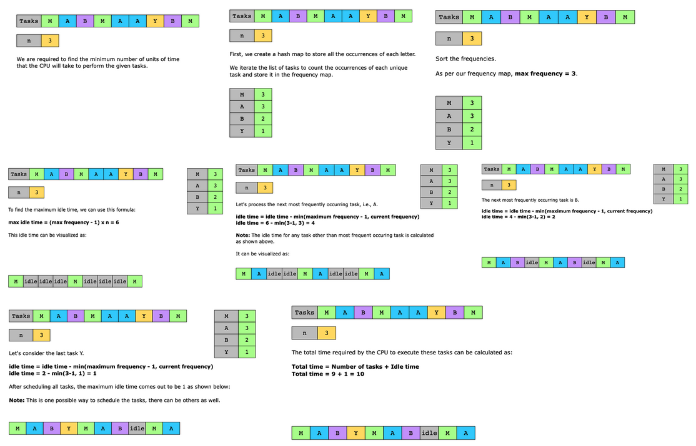

# Task Scheduler

We’re given a character array, tasks, where each character represents a unique task. These tasks need to be performed by a single CPU, with each task taking one unit of time. The tasks can be performed in any order. At any given time, a CPU can either perform some task or stay idle.

For the given tasks, we are also provided with a positive integer value, n, which represents the cooling period between any two identical tasks. This means that the CPU must wait for at least n units of time before it performs the same task again. For example, if we have the tasks [A,B,A,C] and n = 2, then after performing the first A task, the CPU will wait for at least 2 units of time to perform the second A task. During these 2 units of time, the CPU can either perform some other task or stay idle.

Given the two input values, tasks and n, find the least number of units of time the CPU will take to perform the given tasks.

Constraints:

- 1 ≤ tasks.length ≤ 1000
- tasks consists of uppercase English letters.
- 0 ≤ n ≤ 100

## Solution

The optimal strategy is to schedule the most frequent task first, then the second most frequent task, and so on. This is because once we’ve scheduled the most frequent task, we can get an estimate of the maximum idle time. Therefore, we keep track of the frequencies of all tasks using a hash map, frequencies. Let’s say we have tasks = [A,B,C,A,B,A] and n = 2, then frequencies = {A:3, B:2, C:1}. Then, we sort these frequencies so that we can use them later to schedule the tasks in descending order. The most frequent task, i.e., A can be scheduled as A _ _ A _ _ A. Here, we have four idle slots, which can be calculated as:

*Idle time=(Max frequency−1)×n*

Next, we utilize these idle slots to schedule the remaining tasks. The next most frequent task is B, which can be scheduled as: A B _ A B _ A. Now, we’re left with only two idle slots. In general, for every scheduled task, other than the most frequent, the idle slots can be calculated as:

*Idle time=Idle time − Current frequency*

Finally, we can schedule task C in any of the two idle slots. For example: A B C A B _ A. After scheduling task C, all tasks have been scheduled. Therefore, the CPU requires 7 units of time to perform tasks = [A,B,C,A,B,A] with n = 2.

The formula above works fine as long as *Current frequency<Max frequency*. In other words, if we have more than one task having the maximum frequency, the equation above doesn’t hold. Therefore, we consider the maximum frequency at every step, and the formula is modified as:

*Idle time=Idle time−min(Max frequency−1, Current frequency)*

For example, tasks = [A,A,B,B] and n = 2. After scheduling task A as A _ _ A _ _ A , the remaining idle slots become 2. Now, if we schedule task B as A B B A, we break the cooling period rule. Therefore, we need to schedule it as A B _ A B. Using the equation above, the idle time comes out to be 1 because Idle time =2 − min(2−1, 2) = 1.

In general, the total time required by the CPU can be calculated as:

*Total time=Number of tasks+Idle time*

Let’s look at the following illustration to get a better understanding of the solution:

### Time complexity

Counting the frequencies of tasks by iterating over the task list takes O(N), where N is the total number of tasks. Sorting the frequencies list takes O(1) because the size of the list is a constant 26. The proceeding steps also take constant time. The overall time complexity of the solution above is primarily determined by the linear iteration to count frequencies, which is O(N).

### Space complexity

Because the tasks are represented by uppercase English letters, we can have a maximum of 26 unique tasks. We need a constant space to store the frequencies of all the tasks. Therefore, the space complexity of this solution is O(1).