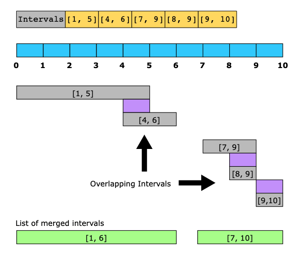

# Merge Intervals

The merge intervals pattern deals with problems involving overlapping intervals. Each interval is represented by a start and an end time. For example, an interval of [10,20] seconds means that the interval starts at 10 seconds and ends at 20 seconds, such that both 10 and time 20 are included in the interval.

The most common problems solved using this pattern are scheduling problems.

The key to understanding this pattern and exploiting its power lies in understanding how any two intervals may overlap. The illustration below shows the six different ways in which two intervals can relate to each other:

## Conditions

- The input data is an array of intervals.
- The problem requires dealing with overlapping intervals, either to find their intersection, their union, or the gaps between them. This may be required as the final goal, or as an intermediate step in the computation of intervals.

## Examples

- Merge overlapping intervals:

- Meeting rooms:

### Real-world problems

Many problems in the real world use the merge intervals pattern. Let’s look at some examples.

-  Display busy schedule: Display the busy hours of a user to other users without revealing the individual meeting slots in a calendar.
- Schedule a new meeting: Add a new meeting to the tentative meeting schedule of a user in such a way that no two meetings overlap each other.
- Task scheduling in operating systems (OS): Schedule tasks for the OS based on task priority and the free slots in the machine’s processing schedule.
