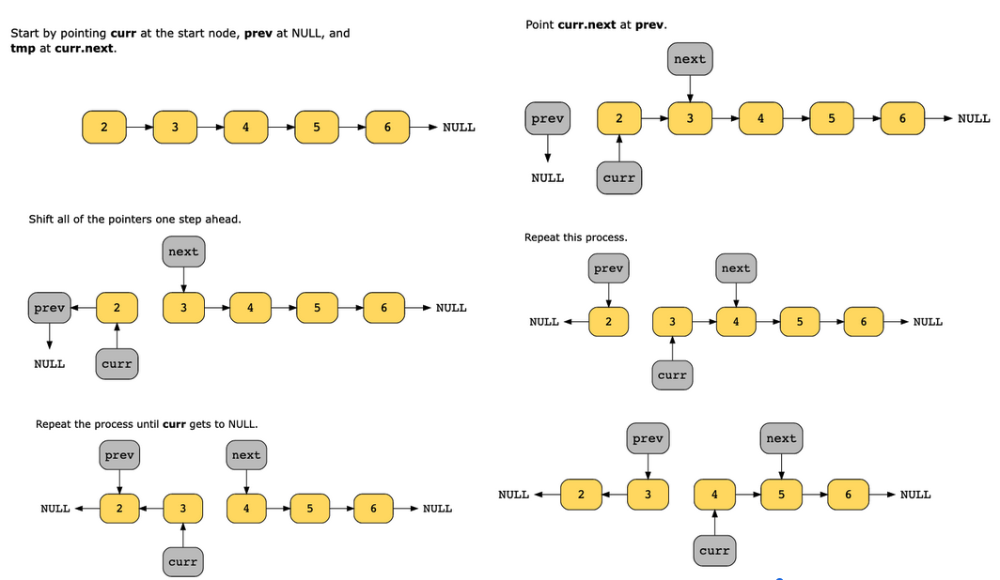
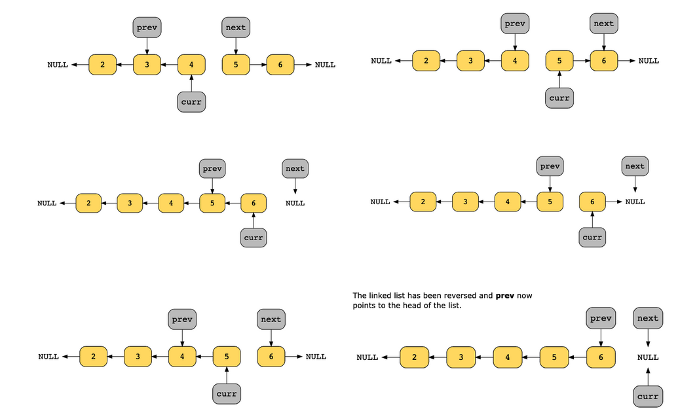
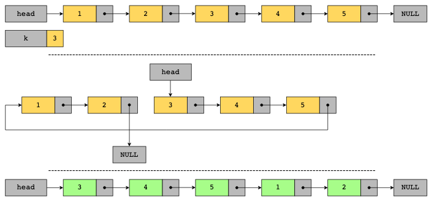
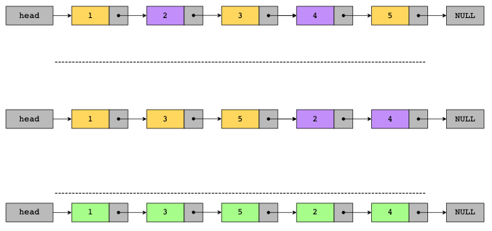
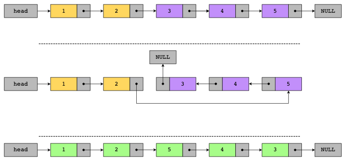

# In-place Reversal of a Linked List

The in-place reversal of a linked list pattern allows us to reverse a linked list without any additional memory, using only the given nodes.

Many problems require a reversal of a set of nodes in a linked list without using additional memory. In such cases, using the in-place reversal pattern is the simplest solution. Instead of making a new linked list with reversed links, we can do it in place, without using additional memory.

How can we achieve an in-place reversal of nodes? We iterate in a linked list and keep track of the current node, the next node, and the previous node simultaneously. Keeping track of the nodes allows us to easily change the links between them and make them point to a different node than before.

When solving such problems, the naive approach of iterating the linked list using nested loops takes O( n^2 ) time. However, using the in-place reversal pattern, the time complexity is O(n) time, since we use a single loop to iterate the linked list.

Similarly, for space complexity: the naive approach requires the use of additional memory—if a linked list contains thousands of nodes, we’d need to allocate a lot of additional memory resources to solve the problem. However, the in-place reversal of a linked pattern will use only O(1) space.

The following illustration demonstrates the reversal of a linked list using the in-place pattern:

## Conditions

- The problem requires reversing a given linked list, either as the end goal, or as an intermediate step of the solution.
- The modifications to the linked list must be made in place, that is, we’re not allowed to use more than O(1) additional space in memory.

## Examples

- Rotate a linked list clockwise k times:

- Append the alternating nodes to the end of a linked list:

- Reverse the second half of a linked list:

### Real-world problems

Many problems in the real world use the in-place reversal of a linked list pattern. Let’s look at some examples:

- Stocks: A total of N stock transactions need to be carried out by K brokers. We need to assign transactions to each broker that need to be carried out in the same order in which they arrived.
- E-commerce: A list of products is arranged such that the first half is in ascending order based on prices and the second half is in ascending order based on popularity. A list of products needs to be displayed on a landing page in pairs of price and popularity such that the first product is cheaper and the second is the most popular.
