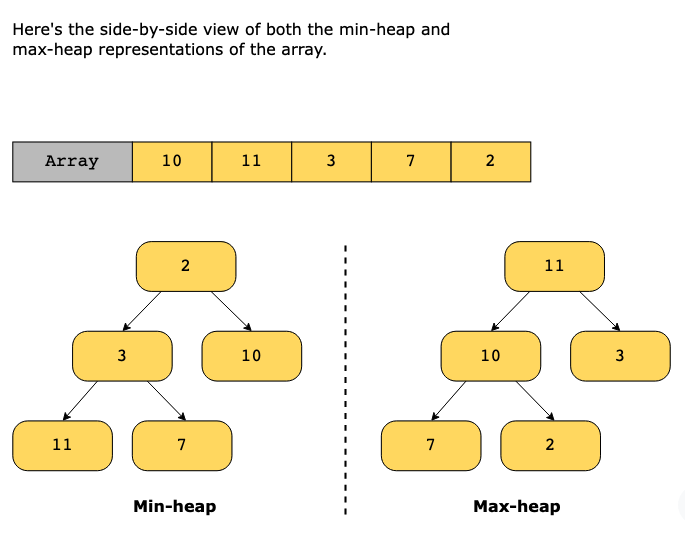
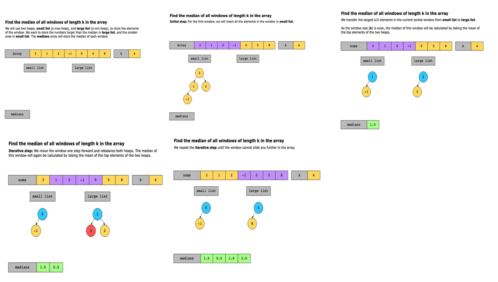
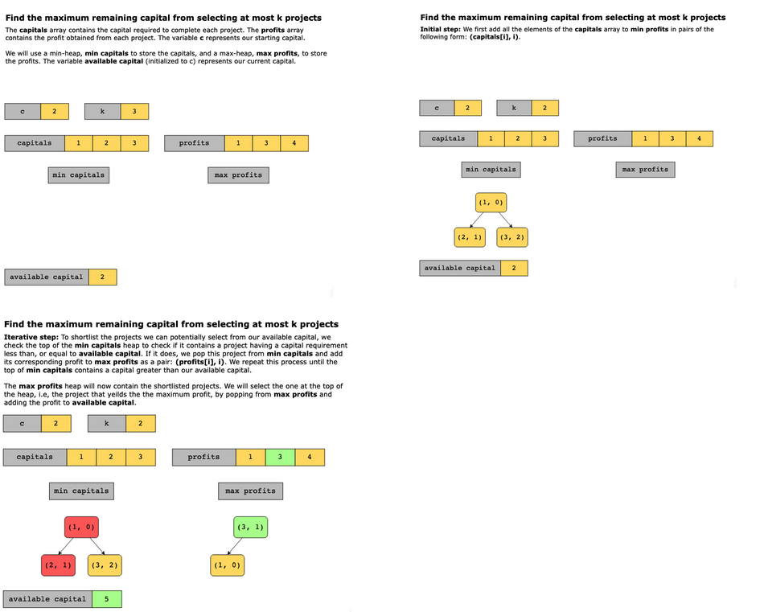

# Two Heaps

As the name suggests, the two heaps pattern uses either two min-heaps, two max-heaps, or a min-heap and a max-heap simultaneously to solve the problem.

Given that there are n elements in a heap, it takes O(logn) time to insert an element in it, O(logn) time to remove an element from it, and O(1) time to access the element at the root of the heap. The root stores the smallest element in the case of a min-heap and the largest element in a max-heap.

In some problems, we’re given a set of data such that it can be divided into two parts. We can either use the first part to find the smallest element using the min-heap and the second part to find the largest element using the max-heap, or we can do the reverse and use the first part to find the largest element using the max-heap and the second part to find the smallest element using the min-heap.

There might be cases where we need to find the two largest numbers from two different data sets. We’ll use two max-heaps to store two different data sets in that case. In other cases, we might need to find the two smallest numbers from two different data sets, and then we would use two min-heaps.

Let’s look at the following illustration to understand how we can use heaps to find the smallest or largest number:

## Conditions

-  We need to repeatedly calculate two maxima, two minima, or one maximum and one minimum, based on a changing set of data.
- The input data is not sorted.

## Examples

- Find the median of all windows of length k in the array:

- Find the maximum remaining capital from selecting at most k projects:

### Real-world problems

Many problems in the real world use the two heap pattern. Let’s look at some examples.

- Video streaming: During a user session, there is often a possibility that packet drops and buffering might occur. We want to record the median number of buffering events that might occur in a particular session, which could then be used to improve the user experience.
- Netflix: As part of a demographic study, we’re interested in the median age of our viewers. We want to implement a functionality whereby the median age can be updated efficiently whenever a new user signs up for video streaming.
