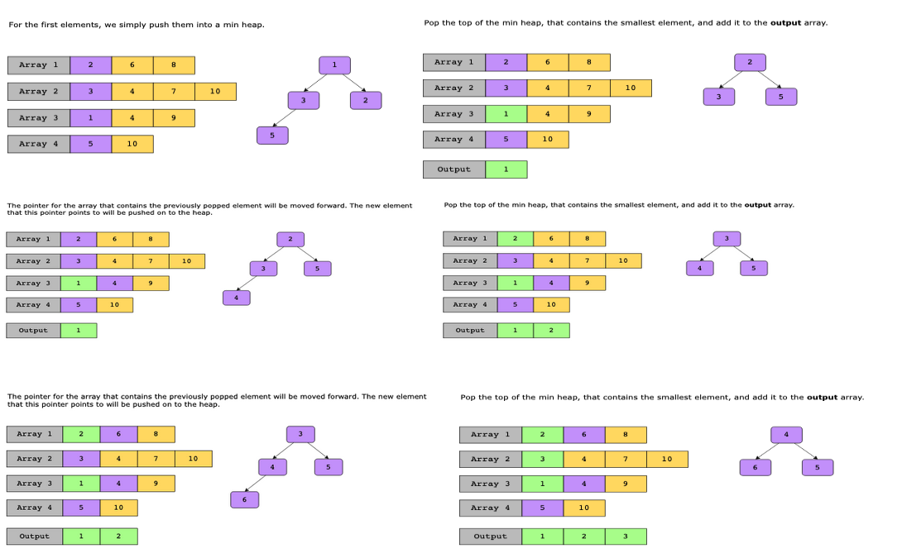
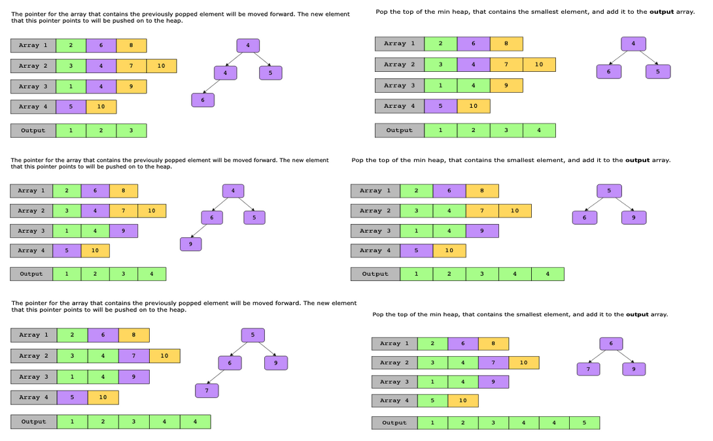
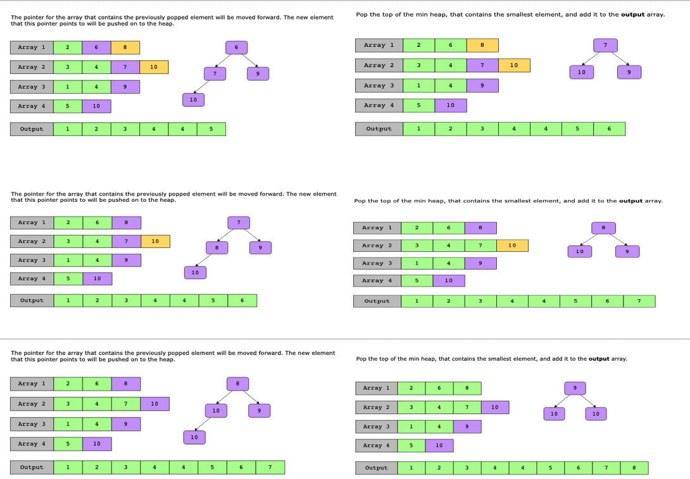
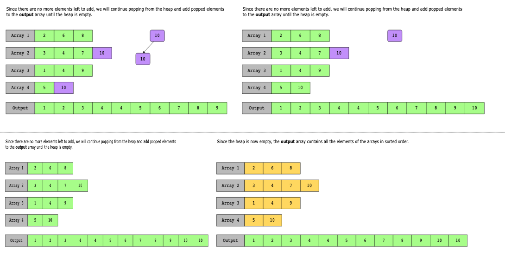
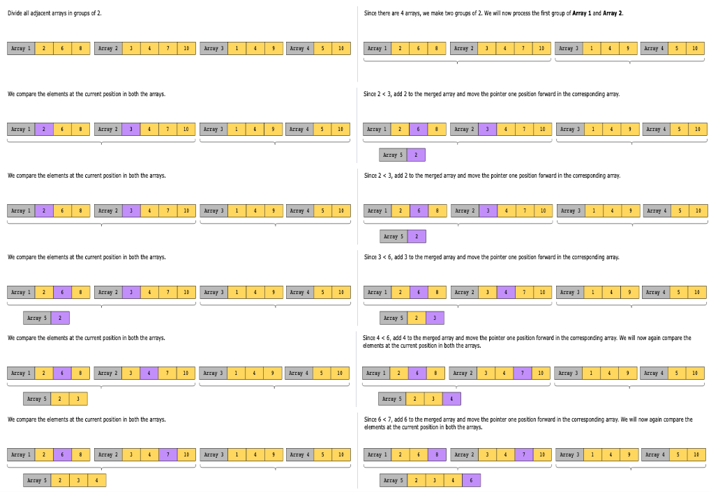

# K-way Merge

The K-way merge pattern is a common algorithmic technique used to merge K sorted data structures, such as arrays and linked lists, into a single data structure that maintains the sorted order. It’s an extension of the standard merge sort algorithm, which merges two sorted data structures into one.

The basic idea behind the K-way merge algorithm is to repeatedly select the smallest (or largest, depending on the sorting order) element among the K input lists and add it to the output list (with the same data type as the inputs). This process continues until all elements from all input lists have been added to the output list.

This pattern actually comprises two techniques that yield the same result:

## Using a min heap

1. Insert the first element of each list in a min-heap.
2. Next, remove the smallest element from the heap and add it to the output list.
3. Keep track of which list each element comes from.
4. From the list from which the last element was selected, pick the next element and push it onto the heap.
5. Repeat steps 2 to 4 to fill the output list in sorted order.

The slides below illustrate an example of using this approach with arrays:

## Making groups of 2 and repeatedly merging them

1. Begin by pairing up the kk sorted lists into groups of 2.
2. Merge each pair of lists using a standard two-way merge operation (like the one used in merge sort), resulting in k/2 merged lists.
3. If there are an odd number of lists in a group, leave one unmerged.
4. Repeat the process of pairing up and merging until only one sorted list remains, which is the final result.

The slides below illustrate an example of using this approach with arrays:

## Conditions

- The problem involves a set of sorted arrays, or a matrix of sorted rows or sorted columns that need to be merged, either for the final solution, or as an intermediate step.
- The problem asks us to find the k^th smallest or largest element in a set of sorted arrays or linked lists.

## Examples

### Real-world problems

Many problems in the real world use the k-way merge pattern. Let’s look at some examples.

- Merge tweets in twitter feed: Sometimes we need to implement a module that adds a user’s Tweets into an already populated Twitter feed in chronological order.
- Used in external sorting procedures: When an algorithm is processing huge amounts of data, it needs to repeatedly fetch it from external storage because RAM capacity is fixed. To overcome the speed limitation of external storage, k-way merges are used in external sorting. Let’s consider a case where we need to perform six merges. A binary merge requires three merge passes while a 6-way merge only requires one pass. K-way merge reduces the number of accesses to external storage, which in turn greatly improves performance when dealing with large amounts of data.
