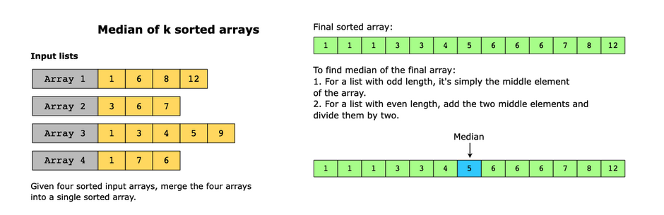

# Modified Binary Search

The modified binary search pattern is an extension of the traditional binary search algorithm and can be applied to a wide range of problems. Before we delve into the modified version, let’s first recap the classic binary search algorithm.

## Classic Binary Search

Binary search is an efficient search algorithm for searching a target value in sorted arrays or sorted lists that support direct addressing (also known as random access). It follows a divide-and-conquer approach, significantly reducing the search space with each iteration. The algorithm uses three indexes —start, end, and middle— and proceeds as follows:

1. Set the start and end indexes to the first and last elements of the array, respectively.
2. Calculate the position of the middle index by taking the average of the start and end indexes. For example, if start=0 and end=7, then middle=⌊(0+7)/2⌋=3.
3. Compare the target value with the element at the middle index.
4. If the target value is equal to the middle index element, we have found the target, and the search terminates.
5. If the target value is less than the middle index element, update the end index to middle−1 and repeat from step 2 onwards. Since the array is sorted, all the values between the middle and the end indexes will also be greater than the target value. Therefore, there’s no reason to consider that half of the search space.
6. If the target value is greater than the middle index element, update the start index to middle+1 and repeat from step 2. Again, since the array is sorted, all the values between the start and the middle indexes will also be less than the target value. Therefore, there’s no reason to consider that half of the search space.
7. Continue the process until the target value is found or if the search space is exhausted, that is, if the start index has crossed the end index. This means that the algorithm has explored all possible values, which implies that the search space is now empty and the target value is not present.

> Note: We’re assuming the array is sorted in ascending order. If it’s sorted in descending order, we’ll do the opposite when changing the positions of the start and end pointers.

The following illustration shows how a binary search operation works using the techniques described above:

Binary search reaches the target value in O(log⁡(n)) time, since we divide the array into two halves at each step, and then focus on only one of these halves. Had we opted for the brute-force approach, we would have had to traverse the entire array, without any partitioning, to search for the target value, which would take O(n) in the worst case.

## Modified Binary Search

The modified binary search pattern builds upon the basic binary search algorithm discussed above. It involves adapting the traditional binary search approach by applying certain conditions or transformations, allowing us to solve more complex problems.

A few common variations of the modified binary search pattern are:

- Binary search on a modified array: Sometimes, the array may be modified in a certain way, which affects the search process. For example, the array might be sorted and then rotated around some unknown pivot. Alternatively, some elements in a sorted array might be modified based on a specific condition. To handle such scenarios, we can modify the basic binary search technique to detect anomalies in the sorted order.
- Binary search with multiple conditions: When searching for a target satisfying multiple conditions, a modified binary search can be used. It involves adapting the comparison logic within the binary search to accommodate multiple conditions. Examples include finding a target range rather than a single target, or finding the leftmost, or the rightmost occurrence of a target value.

## Conditions

- The problem requires us to find a target value (or its first or last occurrence) in a sorted array or a sorted list that supports direct addressing.
- We may use this pattern when segments of an input array are sorted, even if the whole list does not, at first sight, seem to be sorted. For example, we can modify the binary search technique to find a target in a sorted array that has been rotated around an arbitrary pivot.

## Examples

- Find the first and last position of an element in a sorted array

- Integer square root of a number

### Real-world problems

Many problems in the real world use the modified binary search pattern. Let’s look at some examples.

- Dictionary: A dictionary contains words that are alphabetically sorted. Therefore, we can use classic binary search to find the required word quickly. If we wanted to find all the words in the dictionary that share a common prefix, we could modify the comparison operation used in the classic binary search algorithm.
- Debugging with minimal support: Let’s suppose that a code script consists of n lines, and that there is a bug somewhere in the script. Binary search is performed to find the bug by dividing the code based on line numbers. For example, if the code does not run for the first n/2 lines, we further divide the code and check if it runs for the first n/4 lines and so on.
- Student documents: Given a list of students sorted by their scores on a test, find all the students who scored between 40% and 55%.

