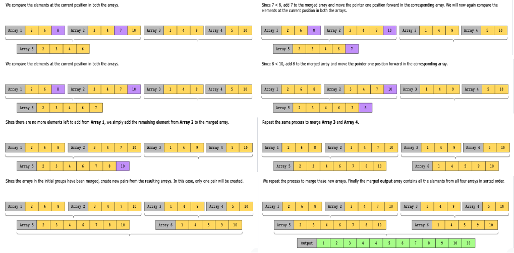
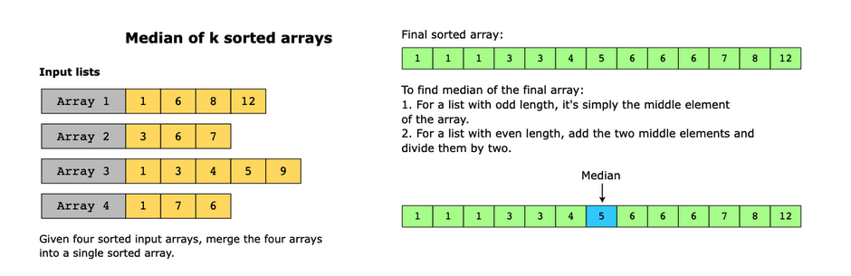

# Greedy Techniques

An algorithm is a series of steps used to solve a problem. There are multiple types of problem solving algorithms, with greedy algorithms being one of them. Greedy is an algorithmic paradigm that builds up a solution piece by piece. This means it chooses the next piece that offers the most obvious and immediate benefit. A greedy algorithm, as the name implies, always makes the choice that seems to be the best at the time. It makes a locally-optimal choice in the hope that it will lead to a globally optimal solution. In other words, greedy algorithms are used to solve optimization problems.

Greedy algorithms work by recursively constructing a solution from the smallest possible constituent parts. A recursion is an approach to problem-solving in which the solution to a particular problem depends on solutions to smaller or equal instances of the same problem. While this technique might seem to result in the best solution, greedy algorithms have the downside of getting stuck in local optima and generally do not return the global best solution. There are a number of problems that use the greedy technique to find the solution, especially in the networking domain, where this approach is used to solve problems such as the traveling salesman problem and Prim’s minimum spanning tree algorithm.

The illustration below shows a simple example that demonstrates the working of a greedy algorithm and also shows how a greedy algorithm doesn’t guarantee an optimal solution.

## Conditions

- If selecting a series of local optima allows us to construct or identify the globally optimum solution.

## Examples

### Real-world problems

Many problems in the real world use the greedy techniques pattern. Let’s look at some examples.

- CPU Scheduling algorithms: Many algorithms which use the greedy approach help in CPU scheduling.
- LAN Networks: In a large LAN with many switches, finding a minimum spanning tree is important to ensure that only a minimum number of packets will be transmitted across the network.
- Social Networking Websites: These applications recommend a list of people that a user may know through the Dijkstra algorithm. The algorithm finds the shortest path between users measured through connections among them.

