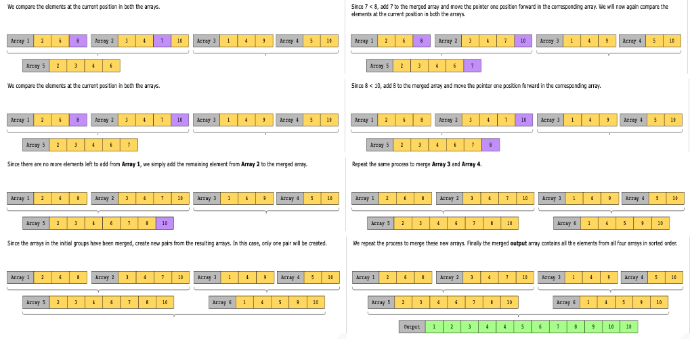

# Backtracking

Backtracking is a technique that explores multiple paths to find the solution. It builds the solution step by step by increasing values with time and removes the choices that don’t contribute to the problem’s solution based on some constraints. Backtracking is different from recursion because, in recursion, the function calls itself until it reaches a base case whereas backtracking tries to explore all possible paths to a solution.

The way backtracking works is that it first explores one possible option. If the required criteria have been met with that option, we choose a path that stems from that option and keep on exploring that path. If a solution is reached from this path, we return this solution. Otherwise, if a condition is violated from the required set of conditions, we backtrack and explore another path.

The backtracking approach is better than brute-force since we don’t have to generate all possible solutions and choose our required solution from among these. It provides us with the option to check our required condition at each possible recursive call. If the condition is met, we continue exploring that path. If it isn’t, we take a step back and explore another path. In this way, we avoid generating redundant solutions.

The following illustration shows how backtracking explores different paths until the base condition is met:

## Conditions

- While constructing any single candidate solution, all paths must be explored. This means that if exploring a certain path results in a dead end, we need to move back one level and explore all the other paths in the solution space.
Example: Determine whether an undirected graph can be colored using no more than n colors in such a way that no two adjacent vertices share the same color.

- The problem requires us to consider all feasible solutions in order to select the best one. While solving such a problem, not a single feasible solution may be ignored. In certain problems, even if some feasible solutions are eventually discarded, we still need to find and evaluate them.
Example: Select elements from an array of strings and concatenate them, such that the concatenated string is of the maximum possible length and contains unique characters.

- The problem requires us to compile a list of all feasible solutions.
Example: Partition a given string into substrings so that each substring is a palindrome. We need to determine all possible ways in which the partitioning can be done to obtain palindromic substrings.

## Examples

### Real-world problems

Many problems in the real world share the backtracking pattern. Let’s look at some examples.

- Constraint satisfaction problems: Backtracking is used to solve puzzles, such as sudoku, where we enter a number into a cell, backtrack if it violates the rules, and try again to find a valid path that satisfies the conditions.

- Recursive descent parsers: The compiler takes a path through the grammar and reaches a point where the incoming tokens no longer match that part of the grammar. Therefore, the compiler backtracks to a point where there is another path through the grammar and follows that. This can occur several times until the compiler finds a grammar path that fits the incoming tokens, in which case it accepts the construct. If it finds no matching path, a syntax error is shown.